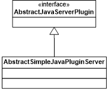
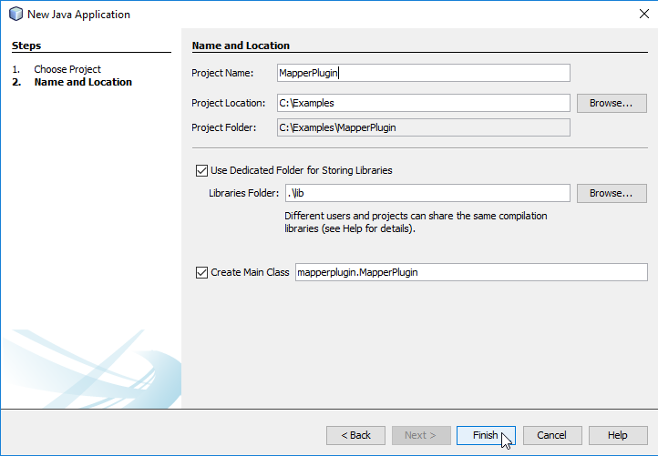

Creating a WAT Model Plug-in
**June 2019**

TABLE OF CONTENTS

[1. WAT Plug-ins](#wat-plug-ins)

[1.1 Background](#background)

[1.2 Overview](#overview)

[1.2.1 Common Base Classes](#common-base-classes)

[1.3 Plug-in Concept](#plug-in-concept)

[1.3.1 Plug-in Interfaces](#plug-in-interfaces)

[1.3.2 SimplePlugin](#simpleplugin)

[1.3.3 WatPlugin](#watplugin)

[1.3.4 DisplayableWatPlugin](#displayablewatplugin)

[1.3.5 Java Program Plug-in](#java-program-plug-in)

[1.3.6 Self-Contained Plug-ins](#self-contained-plug-ins)

[1.4 Implementing Interfaces](#implementing-interfaces)

[1.4.1 Plug-ins containing all of their computational logic](#plug-ins-containing-all-of-their-computational-logic)

[1.4.2 Plug-ins for programs that run outside of the WAT process](#plug-ins-for-programs-that-run-outside-of-the-wat-process)

[1.5 Plug-in startup process](#plug-in-startup-process)

[1.5.1 Plug-in Jar file location](#plug-in-jar-file-location)

[1.5.2 Plug-in Entry Method](#plug-in-entry-method)

[1.5.3 Jar File Manifest Entry](#jar-file-manifest-entry)

[1.5.4 Plug-in initialization](#plug-in-initialization)

[1.5.5 WatPlugin Manager](#watplugin-manager)

[2. Examples](#examples)

[2.1 Debugging Plug-ins through Netbeans and HEC-WAT](#debugging-plug-ins-through-netbeans-and-hec-wat)

[2.2 Simple Plug-in Example](#simple-plug-in-example)

[2.3 Simple Computable Plug-in](#simple-computable-plug-in)

[2.4 Hydrologic Event Generator Plug-in](#hydrologic-event-generator-plug-in)

[2.5 Output Variable Tracking](#output-variable-tracking)

[3. Plug-in API](#plug-in-api)

[3.1 Plug-in Interfaces & Class](#plug-in-interfaces-class)

[3.1.1 Interfaces Overview](#interfaces-overview)

[3.1.2 SimplePlugin](#simpleplugin-1)

[3.1.3 ComputablePlugin](#computableplugin)

[3.1.4 WatPlugin](#watplugin-1)

[3.1.5 DisplayableWatPlugin](#displayablewatplugin-1)

[3.1.6 Java Program Plug-in](#java-program-plug-in-2)

[3.1.7 Self-Contained Plug-ins](#self-contained-plug-ins-1)

[4. Map Drawing](#map-drawing)

[4.1 Graphic Elements](#graphic-elements)

[5. Model Linking](#model-linking)

[5.1 Data Locations](#data-locations)

[5.2 Dynamic Model Linking](#dynamic-model-linking)

[6. Compute](#compute)

[6.1 Passing Information to the Plugin](#passing-information-to-the-plugin)

[6.2 DSS F-Part](#dss-f-part)

[6.2.1 FRA DSS F-Part](#fra-dss-f-part)

[6.3 F-Part Replacement](#f-part-replacement)

[6.3.1 Example of F-Part Replacement](#example-of-f-part-replacement)

[6.3.2 Dynamic Linking](#dynamic-linking)

[6.4 FRA F-Part Replacement](#fra-f-part-replacement)

[7. FRA Related Classes and Interfaces](#fra-related-classes-and-interfaces)

[7.1 Convergence Variables](#convergence-variables)

[7.2 Save Output Flags](#save-output-flags)

[7.3 Performance Metric’s Plug-ins](#performance-metrics-plug-ins)

[8. Appendix](#appendix)

[8.1 Plug-in Interface and Class Methods](#plug-in-interface-and-class-methods)

[8.1.1 SimplePlugin](#simpleplugin-2)

[8.1.2 WatPlugin](#watplugin-2)

[8.1.3 ComputablePlugin](#computableplugin-1)

[8.1.4 DisplayablePlugin](#displayableplugin)

[8.1.5 DisplayableWatPlugin](#displayablewatplugin-2)

[8.1.6 BackgroundImportPlugin](#backgroundimportplugin)

[8.1.7 ClientServerPlugin](#clientserverplugin)

[8.1.8 CreatablePlugin](#creatableplugin)

[8.1.9 DynamicLinkagePlugin](#dynamiclinkageplugin)

[8.1.10 HydrologicEventPlugin](#hydrologiceventplugin)

[8.1.11 IndependentComputablePlugin](#independentcomputableplugin)

[8.1.12 NonInteractiveImportablePlugin](#noninteractiveimportableplugin)

[8.1.13 OutputPlugin](#outputplugin)

[8.1.14 RestartableComputePlugin](#restartablecomputeplugin)

[8.1.15 SaveProjectAsPlugin](#saveprojectasplugin)

[8.1.16 SelfContainedPlugin](#selfcontainedplugin)

[8.1.17 TimeWindowIntervalPlugin](#timewindowintervalplugin)

[8.2 Performance Metric Plug-in](#performance-metric-plug-in)

[8.2.1 PMComputePlugin](#pmcomputeplugin)

[8.2.2 PMComputeAlternative](#pmcomputealternative)

[8.3 Additional Classes](#additional-classes)

[8.3.1 ComputeProgressListener](#computeprogresslistener)

[8.3.2 ComputeOptions](#computeoptions)

[8.3.3 DataLocation](#datalocation)

[8.3.4 FileDataLocation](#filedatalocation)

[8.4 DataLocationUtilities](#datalocationutilities)

[8.4.1 EditActionImpl](#editactionimpl)

[8.4.2 GraphicElement](#graphicelement)

[8.4.3 MessageTaker](#messagetaker)

[8.4.4 ModelAlternative](#modelalternative)

[8.4.5 OutputElementImpl](#outputelementimpl)

[8.4.6 ProgramOrderItem](#programorderitem)

[8.4.7 Project](#project)

[8.4.8 WatPluginManager](#watpluginmanager)

LIST OF FIGURES

[Figure 1 Base Plug-in classes](#_Toc11049855)

[Figure 2 Base Server-side classes](#_Toc11049856)

[Figure 3 WAT Plug-in Interfaces](#_Toc11049857)

[Figure 4 Plug-in Interfaces](#_Toc11049858)

[Figure 5 Design for Java-based programs](#_Toc11049859)

[Figure 6 Non-Java Plugin](#_Toc11049860)

[Figure 7 Non Java Plugin](#_Toc11049861)

[Figure 8 Plugin Decision Logic](#_Toc11049862)

[Figure 9 The HEC-WAT.config file](#_Toc11049863)

[Figure 10 Attaching the debugger](#_Toc11049864)

[Figure 11 Attach Debugger Settings](#_Toc11049865)

[Figure 12 Opening a New Project](#_Toc11049866)

[Figure 13 The New Project Wizard](#_Toc11049867)

[Figure 14 Creating a New Project](#_Toc11049868)

[Figure 15 The Properties Node](#_Toc11049869)

[Figure 16 The Properties Editor](#_Toc11049870)

[Figure 17 Adding jars](#_Toc11049871)

[Figure 18 Selecting jdom-1.0.jar](#_Toc11049872)

[Figure 19 Project Properties with selected jars](#_Ref5016528)

[Figure 20 Mapper Result](#_Toc11049874)

[Figure 21 Creating a new NetBeans project](#_Toc11049875)

[Figure 22 The NetBeans New Project Wizard](#_Toc11049876)

[Figure 23 Creating a project](#_Toc11049877)

[Figure 24 A New Project in NetBeans](#_Ref1051432)

[Figure 25 Opening the Properties Editor](#_Toc11049879)

[Figure 26 The Project Properties Editor](#_Toc11049880)

[Figure 27 Adding jars](#_Toc11049881)

[Figure 28 Adding jdom-1.0.jar](#_Toc11049882)

[Figure 29 Project Properties example](#_Ref1051499)

[Figure 30 Creating a Class](#_Toc11049884)

[Figure 31 The New Java Class Wizard](#_Toc11049885)

[Figure 32 Basic WAT Plug-in Interfaces](#_Toc11049886)

[Figure 33 Plugin classes](#_Toc11049887)

[Figure 34 Graphic Elements Class Relationship](#_Toc11049888)

LIST OF CODE EXAMPLE IMAGES

[Code Example 1 The debug line](#_Toc11049889)

[Code Example 2 Stopping at the Debug Line](#_Toc11049890)

[Code Example 3 MapperPlugin.java](#_Toc11049891)

[Code Example 4 Extending AbstractPlugin from the hec2.plugin Package](#_Toc11049892)

[Code Example 5 Adding Static Variables](#_Toc11049893)

[Code Example 6 MapperPlugin Constructor](#_Toc11049894)

[Code Example 7 Additional MapperPlugin Initialization](#_Toc11049895)

[Code Example 8 Definiing Executable path](#_Toc11049896)

[Code Example 9 Implementing isAppIppInstalled()](#_Toc11049897)

[Code Example 10 Implementing getApplicationPath()](#_Toc11049898)

[Code Example 11 Implementing displayApplication()](#_Toc11049899)

[Code Example 12 Adding Process member](#_Toc11049900)

[Code Example 13 Implementing close( )](#_Toc11049901)

[Code Example 14 Determining the shapefile list in the map window](#_Toc11049902)

[Code Example 15 Implementing openProject() and createProject()](#_Toc11049903)

[Code Example 16 Implementing getProjectName(), saveProject(),getLogFile()](#_Toc11049904)

[Code Example 17 Implementing getVersion(), getDirectory()](#_Toc11049905)

[Code Example 18 Importing namespaces](#_Toc11049906)

[Code Example 19 BasicPlugin Class](#_Toc11049907)

[Code Example 20 Initializing the BasicPlugin](#_Toc11049908)

[Code Example 21 The BasicPlugin constructor](#_Toc11049909)

[Code Example 22 BasicPlugin main()](#_Toc11049910)

[Code Example 23 Implementing getAltFileExtension(),getPluginDirectory(), getVersion()](#_Toc11049911)

[Code Example 24 Defining the DataLocations List](#_Toc11049912)

[Code Example 25 Defining XML elements](#_Toc11049913)

[Code Example 26 Saving Alternative to XML](#_Toc11049914)

[Code Example 27 Loading an Alternative from XML](#_Toc11049915)

[Code Example 28 Implementing saveProject()](#_Toc11049916)

[Code Example 29 Creating a New Alternative](#_Toc11049917)

[Code Example 30 BasicPluginI18n class](#_Toc11049918)

[Code Example 31 The BasicPluginMessages class](#_Toc11049919)

[Code Example 32 Creating a Properties File](#_Toc11049920)

[Code Example 33 BasicAlternativeFactory Contructor](#_Toc11049921)

[Code Example 34 Methods to create new Alternatives](#_Toc11049922)

[Code Example 35 Implementing CreatableWatPlugin](#_Toc11049923)

[Code Example 36](#_Toc11049924)

[Code Example 37 Implementing getDataLocations()](#_Toc11049925)

[Code Example 38 Implementing getOutputDataLocations(),getInputDataLocations()](#_Toc11049926)

[Code Example 39 Filling out getDataLocations()](#_Toc11049927)

[Code Example 40 Implementing defaultDataLocations()](#_Toc11049928)

[Code Example 41 Implementing validLinkedToDssPath()](#_Toc11049929)

[Code Example 42 Implementing setting of DSS path parts](#_Toc11049930)

[Code Example 43 Updating getInputDataLocations(), and getOutDataLocations() to return getDefaultDataLocations](#_Toc11049931)

[Code Example 44 Initial Code for setDataLocations()](#_Toc11049932)

[Code Example 45 Filling out setDataLocations()](#_Toc11049933)

[Code Example 46 Completing Plug-in’s setDataLocations()](#_Toc11049934)

[Code Example 47 Implementing compute()](#_Toc11049935)

[Code Example 48 Implementing setComputeOptions(), isComputable()](#_Toc11049936)

[Code Example 49 Filling out compute()](#_Toc11049937)

[Code Example 50 Implementing Alternative’s compute()](#_Toc11049938)

[Code Example 51 Reading TimeSeriesContainer](#_Toc11049939)

[Code Example 52 Writing TimeSeriesContainer](#_Toc11049940)

[Code Example 53 Implementing Alternative’s compute()](#_Toc11049941)

[Code Example 54 Alternative’s compute()](#_Toc11049942)

[Code Example 55 Implementing OutputPlugin](#_Toc11049943)

[Code Example 56 Implementing hasOutputVariables()](#_Toc11049944)

[Code Example 57 Implementing getAvailOutputVariables()](#_Toc11049945)

[Code Example 58 Output Variable variables](#_Toc11049946)

[Code Example 59 Implementing getOutputValue()](#_Toc11049947)

[Code Example 60 Implementing UpdateTimeSeries()](#_Toc11049948)

[Code Example 61 Implementing computeOutputVariables()](#_Toc11049949)

# WAT Plug-ins

## Background

The HEC-WAT (Watershed Analysis Tool) is an application that links
applications together to conduct evaluations of watersheds as a system
including (but not limited to) risk analysis, historic events, or
predicted events. The WAT install contains plug-ins for all of the
standard HEC models: HEC-HMS, HEC-ResSim, HEC-RAS, and HEC-FIA. The
plug-in technology facilitates the integration of these models into
HEC-WAT.

## Overview

This document introduces the concept of the WAT plug-in and serves as a
roadmap for how to write a model plug-in for HEC-WAT by referencing the
appropriate documents.

### Common Base Classes

There are a few base plug-in classes and interfaces in the hec2.plugin
package. These classes provide basic functionality for plugins.

**Required Interfaces:**

For a Plug-in to work in the WAT at least one of the following needs to
be implemented:

<table>
<thead>
<tr class="header">
<th>SimplePlugin</th>
<th>The base interface for plug-ins.</th>
</tr>
</thead>
<tbody>
<tr class="odd">
<td>WatPlugin</td>
<td>Interface for full participation in the WAT.</td>
</tr>
<tr class="even">
<td>ComputablePlugin</td>
<td>Interface for Plug-ins that participate in computes.</td>
</tr>
<tr class="odd">
<td>DisplayablePlugin</td>
<td>Interface for Plug-ins that interact with the map window and have actions.</td>
</tr>
</tbody>
</table>

**Optional Plug-in Interfaces:**

The following interfaces provide additional optional functionality for a
plug-in:

<table>
<thead>
<tr class="header">
<th>BackgroundImportPlugin</th>
<th>Interface for plug-ins that perform their import process in a background thread.</th>
</tr>
</thead>
<tbody>
<tr class="odd">
<td>ClientServerPlugin</td>
<td>Interface for client/server plug-ins to return information to the WAT client about the status of the server.</td>
</tr>
<tr class="even">
<td>CreatablePlugin</td>
<td>Interface for plug-ins that can create new ModelAlternatives from inside the WAT.</td>
</tr>
<tr class="odd">
<td>DynamicLinkagePlugin</td>
<td>Interface for plug-ins that support dynamic model linkages.</td>
</tr>
<tr class="even">
<td>IndependentComputablePlugin</td>
<td>Interface for plug-ins that don’t participate in the simulation compute, but can compute independently.</td>
</tr>
<tr class="odd">
<td>NonInteractiveImportablePlugin</td>
<td>Interface for plug-ins that can import their data without interaction with the user.</td>
</tr>
<tr class="even">
<td>OutputPlugin</td>
<td>Interface for plug-ins that support Output Variables.</td>
</tr>
<tr class="odd">
<td>RestartableComputePlugin</td>
<td>Interface for plug-ins that can restart themselves during a compute if an error occurs.</td>
</tr>
<tr class="even">
<td>SaveProjectAsPlugin</td>
<td>Interface for plug-ins that need to perform their own save-as when the WAT study is saved-as.</td>
</tr>
<tr class="odd">
<td>SelfContainedPlugin</td>
<td>Interface for plug-ins that have no underlying native model. Allows for actions that would be normally be performed by that native model.</td>
</tr>
</tbody>
</table>

**Plug-in Type Interfaces:**

The following interfaces define special plug-ins that perform specific
operations during the compute process:

<table>
<thead>
<tr class="header">
<th>HydrologicEventPlugin</th>
<th>Interface for plug-ins that can generate the EventTimeWindows during the FRA Compute.</th>
</tr>
</thead>
<tbody>
<tr class="odd">
<td>TimeWindowIntervalPlugin</td>
<td>Interface for plug-ins that fill in the EventList RuntimeWindows during a Non-FRA compute.</td>
</tr>
</tbody>
</table>

**Classes:**

The following are some of the classes that plug-ins can extend to help
fill out functionality:

<table>
<thead>
<tr class="header">
<th>AbstractPlugin</th>
<th>Base class for most plug-ins.</th>
</tr>
</thead>
<tbody>
<tr class="odd">
<td>AbstractComputablePlugin</td>
<td>Base class for plug-ins that compute.</td>
</tr>
<tr class="even">
<td>AbstractJavaClientPlugin</td>
<td>Client-side class for plug-ins (like ResSim) that start their Java application in a separate JVM. Handles starting/restarting the server.</td>
</tr>
<tr class="odd">
<td>AbstractSimpleJavaPluginServer</td>
<td>Server-side class for plug-ins (like ResSim) that start their Java applications in a separate JVM.</td>
</tr>
<tr class="even">
<td>AbstractJavaServerPlugin</td>
<td>RMI Interface for the AbstractSimpleJavaPluginServer.</td>
</tr>
</tbody>
</table>

**Additional Classes:**

The following are additional classes that the plug-in will use:

<table>
<thead>
<tr class="header">
<th><a href="#computeprogresslistener">ComputeProgressListener</a></th>
<th>Listener that plug-ins post messages and progress to during the compute.</th>
</tr>
</thead>
<tbody>
<tr class="odd">
<td><a href="#computeprogresslistener">ComputeOptions</a></td>
<td>Holds the Compute Options during the compute.</td>
</tr>
<tr class="even">
<td><a href="#datalocation">DataLocation</a></td>
<td>Used during model linking. Indicates a location where a plug-in produces or consumes data.</td>
</tr>
<tr class="odd">
<td><a href="#editactionimpl">EditActionImpl</a></td>
<td>Action that shows up in menus in the WAT for the user to interact with the native application for editors.</td>
</tr>
<tr class="even">
<td><a href="#graphicelement">GraphicElement</a></td>
<td>Base class for objects that represent various parts of the model schematic.</td>
</tr>
<tr class="odd">
<td><a href="#messagetaker">MessageTaker</a></td>
<td>Interface to post messages to the WAT messages pane.</td>
</tr>
<tr class="even">
<td><a href="#modelalternative">ModelAlternative</a></td>
<td>WAT representation of the collection of the modeling data needed to run.</td>
</tr>
<tr class="odd">
<td><a href="#outputelementimpl">OutputElementImpl</a></td>
<td>Action that shows up in menus in the WAT for the user to interface with the native application to display modeling output.</td>
</tr>
<tr class="even">
<td><a href="#programorderitem">ProgramOrderItem</a></td>
<td>Placeholder in a list of programs that a simulation will run.</td>
</tr>
<tr class="odd">
<td><a href="#project">Project</a></td>
<td>The collection of WAT data for a study.</td>
</tr>
<tr class="even">
<td><a href="#watpluginmanager">WatPluginManager</a></td>
<td>Clearinghouse for finding plug-ins.</td>
</tr>
</tbody>
</table>

**Exception Classes:**

The following exceptions can be thrown by the Plug-in:

<table>
<thead>
<tr class="header">
<th>ModelLinkingException</th>
<th>Thrown by the plug-in when a problem occurs during saving of model linking data.</th>
</tr>
</thead>
<tbody>
<tr class="odd">
<td>NoWatershedOpenedException</td>
<td>Thrown by a plug-in when it doesn’t have its project open and its asked to perform an action.</td>
</tr>
<tr class="even">
<td>OutputException</td>
<td>Thrown by the plug-in when an error occurs during trying to display output.</td>
</tr>
</tbody>
</table>

  
   
  Figure 1 Base Plug-in classes

  
   
    Figure 2 Base Server-side

classes

## Plug-in Concept

The plug-in concept exists to facilitate homogeneity between different
programs and communication between the programs. The plug-in operates as
an adapter, enveloping a complicated model and producing a consistent
set of externally facing API calls shared across all applications that
are being “plugged in”. This API facilitates passing data, execution
computations, editing alternatives, and viewing results. A plug-in must
be developed for any existing model to fulfill the required API calls,
and to be recognized within the HEC-WAT framework.

HEC-WAT has no awareness of model program’s specific logic, data
storage, or purpose. Through the use of a program plug-in, the WAT
incorporates a program seamlessly into the user interface and/or
computational logic. There are many different levels of integration
available depending on the type of plug-in interfaces that are
implemented on the instance of the plug-in. For programs that already
exist and are fully functional outside of HEC-WAT, a client-server
architecture with the WAT acting as the client and the model program as
the server provides a way to integrate complex programs while keeping
the program separated from the WAT. The client-server connection can be
implemented in any fashion that works for the program. Traditionally,
Java RMI has been used as the transport layer between the client and
server sides, though the plug-in developer is free to use the
communication mechanism they want between their client and server sides.
While all plug-ins must be written in Java, the model or program that
the plug-in is wrapping isn’t required to be written in Java. Plug-ins
have been written for Java programs, C++ programs, Fortran programs,
VB/VB.net programs, and both command line programs and programs that
have their own user interface. HEC-WAT is packaged with plug-ins for
models written in Java and non-Java based models.

### Plug-in Interfaces

There are three main plug-in interfaces that a plug-in must implement
one of: SimplePlugin, WatPlugin, or DisplayableWatPlugin. The
ClientServerPlugin interface should be implemented for plug-ins that are
client-server.

A plug-in only needs to implement one of SimplePlugin, WatPlugin, or
DisplayableWatPlugin depending on the level of integration desired. A
plug-in can implement many interfaces to exploit different functions
made available to control HEC-WAT. For a complete list of all plug-in
interfaces, and description of the purpose of their methods and
descriptions of any parameters, please refer to the plug-in [API
appendix](#appendix).

If the model exists and needs to run as a separate process from HEC-WAT,
the best way is through the client-server architecture. To achieve this,
the plug-in must implement hec2.wat.plugin.ClientServerPlugin. The
ClientServerPlugin interface allows HEC-WAT to interrogate the plug-in
for the status of the server part of the plug-in.

<table>
<thead>
<tr class="header">
<th>SimpleWatPlugin</th>
<th>Interface for the simplest plug-ins, which are only to be used as tools by the WAT.</th>
</tr>
</thead>
<tbody>
<tr class="odd">
<td>WatPlugin</td>
<td>Interface for plug-ins that participate in the compute process. This extends SimpleWatPlugin.</td>
</tr>
<tr class="even">
<td>DisplayableWatPlugin</td>
<td>Interface for plug-ins to display information on the MapSchematic, and provide actions for the various menus. This extends WatPlugin.</td>
</tr>
<tr class="odd">
<td>ClientServerPlugin</td>
<td>Interface for client/server plug-ins to return information to the WAT client about the status of the server.</td>
</tr>
</tbody>
</table>

  
   
    Figure 3 WAT Plug-in Interfaces

Figure 3 

### SimplePlugin

A plug-in must implement the interface hec2.wat.client.SimpleWatPlugin.
This interface defines the basic functionality that a plug-in must
support such as creating a project, opening a project, or getting a list
of model alternatives. This is an empty marker interface and all its
methods come from hec2.plugin.SimplePlugin.

### WatPlugin

Plug-ins inserted into a WAT Simulation compute must implement
hec2.wat.plugin.WatPlugin, which extends hec2.wat.plugin.SimpleWatPlugin
and defines methods used by the Simulation process.

### DisplayableWatPlugin

Plug-ins that need to display information on the map schematic should
implement the interface hec2.wat.client.DisplayableWatPlugin. The
DisplayableWatPlugin interface defines additional functionality that a
plug-in must support to be displayed on a map schematic. This may
include returning a list of elements to display, displaying an editor
for an item, or displaying output for one or more element.

The hec2.wat.client.DisplayableWatPlugin interface extends
hec2.wat.client.WatPlugin.

The four HEC programs will all be DisplayableWatPlug-ins since they all
have graphics elements.

### Java Program Plug-in

Some of the Java-based programs (i.e. ResSim, and FIA) all share a
common client-side plug-in and RMI interface for the server side. As the
server side is unique to each program that the client only needs to
implement a couple of methods. Since the server-side component of the
plug-ins will all be implemented using the same RMI interface, the
client side can be based on the same base class, with the only
difference being the server that they launch.

### Self-Contained Plug-ins

The Hydrologic Sampling and Fragility Curve Plug-ins are written
completely in the plug-in and do not rely on the client-server design of
the other plug-ins. To support this, new classes were added to the
plug-in framework. The new classes were written to make it easier for
other plug-ins to be written by factoring common code into a few
classes.

#### Base Classes

The class hec2.wat.plugin.AbstractSelfContainedPlugin is the base class
for plug-ins that handle everything themselves (not the existing model
that they are wrapping). The class signature looks like:

> public abstract class AbstractSelfContainedPlugin\<E extends
> SelfContainedPluginAlt\> extends AbstractComputablePlugin implements
> DisplayableWatPlugin, SelfContainedPlugin

A plug-in that extends AbstractSelfContainedPlugin will have a
constructor similar to this:

> public class FragilityCurvePlugin extends AbstractSelfContainedPlugin
> \<FragilityCurveAlt\> implements CreatableWatPlugin

## Implementing Interfaces

Implementing the plug-in interfaces within the plug-in jar allows a
programmer to fulfill the HEC-WAT plug-in API by creating an adapter for
the API of the model. Within HEC-WAT, all plug-ins are referred to
through these interfaces and HEC-WAT does not know which process each
plug-in represents in the watershed.

### Plug-ins containing all of their computational logic

The simplest design for plug-ins occurs when the plug-in is the entire
model — many plug-ins use this design within HEC-WAT. These plug-ins are
“self-contained” because they contain all of their own computational
logic. The logic is completely in the plug-in and doesn’t need the
client-server design of the other plug-ins.

To support this some new classes were added to the plug-in framework
extending the interfaces described above. The new classes make it easier
for other plug-ins to be written, factoring common code into a few
classes.

1.1.1.1 Base Self-Contained Classes

The class hec2.wat.plugin.AbstractSelfContainedPlugin is the base class
for plug-ins that handle everything themselves (they are not wrapping an
existing model). The class signature looks like:

public abstract class AbstractSelfContainedPlugin\<E extends
SelfContainedPluginAlt\> extends AbstractComputablePlugin implements
DisplayableWatPlugin, SelfContainedPlugin

A plug-in that extends AbstractSelfContainedPlugin will have a
constructor similar to this:

public class FragilityCurvePlugin extends
AbstractSelfContainedPlugin\<FragilityCurveAlt\> implements
CreatableWatPlugin

  
   
    Figure 4 Plug-in Interfaces

### Plug-ins for programs that run outside of the WAT process

For other models that want to run the modeling application in a separate
process, there are base classes in the WAT that can be extended which
provide the basic functionality of proxying the plug-in API calls from
the client portion of the plug-in (client portion of the plug-in resides
in the same JVM as the WAT) to the server portion of the plug-in.

#### Java Program Plug-in

The Java-based programs share a common client-side plug-in and RMI
interface for the server side. The server side is unique to each program
so the client needs to only implement a couple of methods. Since the
server-side component of the plug-ins is implemented using the same RMI
interface, the client side can be based on the same base class, with the
only difference being the server that they launch.

There are two categories of designs used to incorporate the HEC modeling
programs. The first one is used for the Java® based programs. This
design is shown below:

  
   
    Figure 5 Design for Java-based programs

#### Non Java Program Plug-in

The second design is for programs that are not written in Java such as
C\# or Visual Basic programs.

  
   
    Figure 6 Non-Java Plugin

The final plug-in design is for plug-ins that handle most of the plug-in
details but launch an external program for the computation. This process
works well for programs that are written as command line accessible
programs.

  
   
    Figure 7 Non Java Plugin

It is not intended that any of the standalone model programs contain
WAT-specific code when they are running outside of the WAT environment.

When designing a plug-in, there are a few critical questions that must
be asked prior to beginning:

1.  Will the plug-in operate as a part of the WAT compute sequence?

2.  Will the plug-in generate events or consume event data?

3.  Does the computational logic for the program exist already?

4.  Is the computational logic written in Java?

5.  Can the computational engine operate within the WAT JVM?

## Plug-in startup process

For a plug-in to be recognized by the WAT, it has to implement an entry
method and perform a few startup tasks. The Plugin classes/jar file also
have to be in the WAT’s classpath.

### Plug-in Jar file location

The plug-in’s jar file must be placed in the WAT’s install folder’s
jar/ext folder. When the WAT starts it searches that folder for jar
files and for every jar file found it checks it for a valid manifest
entry. During development and debugging of a plug-in, placing an the
plug-in’s jar file in the jar/ext folder with just the manifest entry
and no classes and then referencing the plug-in classes in the classpath
makes things easier because the plug-in jar file doesn’t have to keep
being updated.

### Plug-in Entry Method

Plug-ins are started by the com.rma.util.PluginLoader. It calls the
plug-in’s main class’s public static void main(String\[\]) method to
start the plug-in. The class containing the main method must be
specified in the plug-in jar’s manifest file.

### Jar File Manifest Entry

In the plug-in’s jar file, in the META-INF folder there’s a MANIFEST.MF
file. The manifest file must contain the entry:

WatPluginMainClass: \<path to plugin class with main method\>

As an example:

WatPluginMainClass: hec2.wat.plugin.ras.RasPluginClient

It is possible to have multiple plug-ins in a single jar file. Just
append a unique identifier after the WatPluginMainClass.

WatPluginMainClass1: myplugins.MyPlugin1  
WatPluginMainClass2: myplugins.MyPlugin2

### Plug-in initialization

The Plug-in must register with the hec2.wat.plugin.WatPluginManager to
be recognized by the WAT. They also need to create a
hec2.model.ProgramOrderItem and register it with the
hec2.model.ProgramOrderItem class with a call to
ProgramOrderItem.addProgramOrderItem(ProgramOrderItem) to participate in
a compute.

If the plug-in has a server-side component, its server should be started
up during the plug-in’s initialization.

### WatPlugin Manager

The WAT contains a Plug-in Manager (hec2.wat.plugin.WatPluginManager)
that all plug-ins that wish to participate in simulation modeling are
required to register with. To register with the WAT PluginManager the
plug needs to implement the WAT Plug-in interface
hec2.wat.plugin.BasicWatPlugin or one of its subinterfaces. The call to
the WAT Plug-in Manager is simple:

WatPluginManager.register(this);

# Examples

Developing plug-ins for the WAT may seem like a daunting task, but this
guide seeks to provide simple cases to explain how the plug-in API can
be used to accomplish simplified tasks. One major hurdle for developing
plug-ins is the ability to debug into the code. Since the typical
developer will not have access to the WAT source code, they will be
running from a compiled (and obfuscated) set of the executable. This
makes debugging the application different, but not impossible. The
[first tutorial](#debugging-plug-ins-through-netbeans-and-hec-wat)
describes the steps to attach a debugger to the plug-in, so that one can
step into the plug-in code (and from there into portions of the compiled
jars).

For the [simple plug-in](#simple-plug-in-example), we will create a
mapping tool in the toolbar for WAT. This will allow users to view and
edit the maps in the current active map window of the WAT. This is the
simplest plug-in API to implement, and requires only one class to be
built. This example takes between two and four hours to complete for
someone familiar with developing in Java.

For the [simple computable plug-in](#simple-computable-plug-in), we are
going to create a plug-in that is part of a WAT compute sequence
(specifically the FRA compute sequence), that consumes event
information. The plug-in will consume one DSS time series record as
input, and produce one time series record as output. For the sake of
simplicity, the time series record will be multiplied by a uniform
random number provided by the WAT which represents the event random
number, in the case of POR events, the time series will simply be
multiplied by 2. The plug-in is going to be built from scratch in Java,
and can operate within the WAT JVM. These questions help to determine
what interfaces must be implemented within the plug-in’s main class

For the [Hydrologic Event Generator
plug-in](#hydrologic-event-generator-plug-in), we are going to create a
single event that is the same length as the analysis period provided by
the user. Using the BasicPlugin created using the simple computable
plug-in instructions, this tutorial copies the project, changes the
required project names and packages, and adds the implementation of the
Hydrologic Event Generator interface. This plug-in can now appear as an
Event Generator in the FRA program sequence. It shows how to modify the
compute options to define the event list and how to provide the compute
options to the WAT.

  
   
    Figure 8 Plugin Decision Logic

## Debugging Plug-ins through Netbeans and HEC-WAT

It can be complicated to know why or how a plug-in is failing without
being able to run the source code for the WAT. This document describes a
way to facilitate stepping into your plug-in project while the HEC-WAT
instance is running so you can debug your plug-in (and step into some
WAT classes).

Once you have written your plug-in and have added the plug-in jar to the
jar/ext folder, you can launch HEC-WAT and your plug-in should be added
to HEC-WAT. If you encounter issues you would like to see via a
debugging session in the Netbeans IDE, you can follow these steps.

The first step is to modify the HEC-WAT.config file. The HEC-WAT config
file lives next to the HEC-*WAT.exe*.

  
   
    Figure 9 The HEC-WAT.config file

Add the following line to the bottom of the config file:

vmparam -Xdebug
-Xrunjdwp:transport=dt\_socket,server=y,suspend=n,address=5000

This line will establish a connection through port 5000 between Netbeans
and the running process of HEC-WAT.

Once this line has been added, launch HEC-WAT using the *HEC-WAT.exe*
next to the config file. Before any actions are taken in HEC-WAT, open
the Netbeans IDE with your plug-in’s project.

The example project we are using is the Mapper plug-in from the Simple
Wat Plug-in introduction. The debug line we will enter on is the line
that will first be called when the button in the toolbar is clicked.

To attach the debugger, we will click on Debug in the main menu, and
then select “Attach Debugger”

  
   
    Figure 10 Attaching the debugger

Review the Attach Window settings to ensure the port number is set to
5000, and then select **OK**.

  
   
    Figure 11 Attach Debugger Settings

The debug break line is set on line 94:

  
   
    Code Example 1 The debug line

If we now click the mapper button in the toolbar, the process will stop
on line 92.

  
   
    Code Example 2 Stopping at the Debug Line

This will allow us to step over or into any method. This includes
methods contained in the compiled WAT jars. Be aware that some of the
compiled WAT jars are obfuscated, so the debugger will not make sense in
those cases.

It should be noted that certain methods are difficult to debug this way.
Since WAT launches the plug-ins from their main method very early in the
WAT execution path, it is nearly impossible to attach the debugger in
time to catch the main method execution in a plug-in.

##  Simple Plug-in Example

For this simple plug-in, we are going to create a plug-in that displays
a mapping and map editing application. The plug-in will launch from a
button in the toolbar of the WAT and identify whether a valid project is
open or not when the button is clicked. If a project is detected, it
will search for the active map window and load all shapefiles into the
mapping tool for display.

Objectives:

  - Demonstrate how to build the simplest WAT plug-in type.

  - Explain how to loosely connect the plug-in to a project.

  - Show basic code to inspect the maps in the active map window.

This tutorial uses the NetBeans IDE although any Java IDE will work. To
begin, create a new project. The main class name will ultimately be the
name of the plug-in jar that is placed in WAT so it is recommended that
the project name be the same as the plug-in name you wish to use.

To create a new NetBeans project launch NetBeans, and select **File \>
NewProject…**

  
   
    Figure 12 Opening a New Netbeans Project

The new project wizard will appear and prompt you to define the project
type. Within the Java category, select the project type
**JavaApplication** and press **Next.**

  
   
    Figure 13 The New Project Wizard

Name the project, define its location, and name the main class for the
project. It is recommended that a dedicated folder for storing libraries
is created and named lib. Once this step has been completed select
**Finish**.

  
   
    Figure 14 Creating a New Netbeans Project

NetBeans will create a new project, a new package based on your project
name, and a new main class based on the name you defined. Next, we will
add all required referenced jars to the lib folder.

You should see something in the NetBeans IDE similar to the code shown
below:

  
   
    Code Example 3 MapperPlugin.java

We need to add some reference jars located within the HEC-WAT directory
under the jars folder. To add the jars, right click on the **Project**
node in the Project pane, and select **Properties**.

  
   
    Figure 15 The Properties Node

The Properties Editor will appear. In the left-hand pane, select
**Libraries** then click **Add Jar/Folder**.

  
   
    Figure 16 The Properties Editor

Browse to HEC-WAT/jar and select the following jars:

*hec.jar, hecnf.jar, hecnfPlugin.jar, rma.jar, rmadev.jar, watModel.jar
and wat.jar.*

  
   
    Figure 17 Adding jars

Click **Add Jar/Folder**, go into the sys folder and select
*jdom-1.0.jar*.

  
   
    Figure 18 Selecting jdom-1.0.jar

Your Project’s properties should look like Figure 19.

  
   
    Figure 19 Project Properties with selected jars

This plug-in will extend AbstractPlugin from the hec2.plugin package and
implement the hec2.wat.plugin.SimpleWatPlugin interface. After adding
that to the class definition, the project should look like this:

  
   
    Code Example 4 Extending AbstractPlugin from the hec2.plugin Package

Our next task is to implement all required methods.

To begin, add some static final strings for the name of the plug-in, the
short name for the plug-in, and the version of the plug-in.

  
   
    Code Example 5 Adding Static Variables

Next, initialize the Mapper Plug-in in the constructor and create an
instance of the plug-in in the main sub. This step will require adding
an import for the hec2.wat.plugin.WatPluginManager.

  
   
    Code Example 6 MapperPlugin Constructor

We have set the name of the plug-in, initialized any abstract elements,
and registered with the WatPluginManager. To give the user access to the
plug-in from the WAT user interface, the plug-in needs to be added to
some graphical element of the user interface. An easy place to store a
utility tool like this is the tool bar. A simple method is added to the
class to add the plug-in as a BrowserAction to the toolbar menu of the
WAT user interface. The code being added requires added imports for
com.rma.client.Browser, com.rma.client.BrowserAction,
hec2.wat.client.WatFrame, javax.swing.Action, javax.swing.Icon, and
rma.swing.RmaImage.

  
   
    Code Example 7 Additional MapperPlugin Initialization

There are a few items worth noting here:

1)  The isAppInstalled() method has not been defined (we will define it
    next).

2)  An icon is set using the path Images/ this is in the images jar
    stored within the jar folder of the WAT. If you wish to add your own
    icon, open *images.jar*, insert the image, and re-compress the file.
    In this case an image called “Globe\_20.png” was added to the
    *images.jar* root directory. Images in the toolbar are 20 x 20. If
    you provide a larger image, the toolbar will grow to fit the image
    which may impact the look and feel of the toolbar in a negative way.

3)  In the creation of the BrowserAction, the action is identified by
    the fourth argument on the constructor. Each plug-in needs a unique
    name for the BrowserAction. A good practice is to include the
    plug-in name in the name of the action. The method backing the
    string needs to be included in the class with the same spelling and
    capitalization. We will make this method in one of the following
    steps.

To determine if the application is installed, we will need to define the
path to the application. Within HEC-WAT there are two main locations
where applications live: the apps directory at the same level as the
HEC-WAT directory and the ext directory where all plug-in jars are
stored. We are going to store the application in the ext folder in a sub
directory called Mapper and the executable will be called
*MapperView.exe*.

In official installations, it is possible that the user will not have
admin rights to modify the directories in the HEC-WAT folders — the
plug-in developers should consider this as they are developing their
applications.

We need to add the appropriate file path to the application as a private
variable to the plug-in.

  
   
    Code Example 8 Defining Executable path

Right-click isAppInstalled() and let the IDE add the method at the
bottom of the class and implement it.

  
   
    Code Example 9 Implementing isAppIppInstalled()

This method will add an import for com.rma.io.FileManagerImpl.
getApplicationPath() is a method we need to add. This is written so that
we can get the application path in two different locations within the
plug-in, determine if the application exists, and launch it later.

  
   
    Code Example 10 Implementing getApplicationPath()

This method will add an import for hec.appInterface.AppDaddy. From the
AppDaddy class we are able to get the current application (HEC-WAT) and
the working directory where the *HEC-WAT.exe* is stored. From there, we
add *jar/ext/Mapper/MapperView.exe* to fully qualify the path to the
mapper executable. This step of identifying the working directory
ensures that the directory is the WAT directory instead of using other
methods supplied in java.IO because some other developers in other
applications may modify the current working directory.

Our next task is to implement the displayApplication() and
displayApplicationUnique() methods. This will launch the application
when the button in the toolbar is pressed.

There is no information directly provided via injection in the
displayApplication() method required by the SimpleWatPlugin interface.
However, through the use of some of the RMA libraries, one can determine
pertinent information about the current state of the WAT.

The simplest thing to do in this case is launch the mapping application
via command line with no variation based on the status of the current
WAT instance. The code to do that will look something like this:

  
   
    Code Example 11 Implementing displayApplication()

This requires an import for java.lang.IOException. A private variable of
type Process was added to keep a pointer to the process that was
initialized to shut down the process if WAT requests the application to
shut down.

  
   
    Code Example 12 Adding Process member

This can be accomplished through the Close() method.

  
   
    Code Example 13 Implementing close( )

It is possible to connect this plug-in closer with the WAT instance in a
few different ways. For instance, determining whether an existing
project is opened and whether the existing project has a map window. If
there is a map window, we can use that map window to define a list of
shapefiles to add to the mapper program through the mapper plug-in. For
all of this to work, the mapper program needs to be able to accept
command line arguments of the shapefile paths to be able to display the
shapefiles in the mapper’s map window.

The following code determines the list of shapefiles in the map window,
if there is a current project with a map window open, and constructs a
string that will provide the shapefiles as a command line argument:

  
   
    Code Example 14 Determining the shapefile list in the map window

This mapper produces the following result:

  
   
    Figure 20 Mapper Result

There are a few additional details that need to be finalized. There are
a handful of methods that have not been implemented:

  - boolean createProject(Project prjct)

  - boolean openProject(Project prjct)

  - String getProjectName()

  - boolean saveProject()

  - String getLogfile()

  - String getVersion()

  - String getDirectory()

None of these are absolutely necessary to create a utility program, but
each can provide a variety of useful features. For this tutorial they
are implemented as seen below:

  
   
    Code Example 15 Implementing openProject() and createProject()

  
   
    Code Example 16 Implementing getProjectName(), saveProject(), getLogFile()

  
   
    Code Example 17 Implementing getVersion(), getDirectory()

Please conduct the following steps (based on section 1.5.3 and 1.5.4) to
ensure the correct main class can be found by the WAT in the manifest
file.

Update the manifest file to contain a directive for HEC-WAT to know what
main class to use for the plug-in file. You can accomplish this in many
ways, but the simplest is to update the file using a text editor.

Browse to the project directory with your file explorer. Open the
*manifest.mf* file in any text editor and insert the following line
WatPluginMainClass: basicplugin.MapperPlugin. Your main class will be
dependent on the name of your project and main class.

After this step is completed, build your project. If you go to the dist
directory of your project directory using a file explorer, you can copy
your jar file and paste it into the *HEC-WAT v1/jar/ext/* directory. You
should see your plug-in in the plug-in list next time you launch WAT.

## Simple Computable Plug-in

Objectives:

  - Demonstrate how to add the methods for a plug-in to compute in a
    simulation.

For the simple computable plug-in, we are going to create a plug-in that
is part of a WAT compute sequence (specifically the FRA compute
sequence) that consumes event information. The plug-in will consume one
DSS time series record as input and produce one time series record as
output. For simplicity, the time series record will be multiplied by a
uniform random number provided by the WAT representing the event random
number. In the case of POR events, the time series will be multiplied by
2. The plug-in is going to be built in Java from scratch and can operate
within the WAT JVM. These questions help to determine which interfaces
must be implemented within the plug-in’s main class.

This tutorial will use the NetBeans IDE although any Java IDE will work.
To begin, create a new project. The main class name will ultimately be
the name of the plug-in jar that is placed in WAT, so it is recommended
that the project name be the same as the plug-in name you wish to use.

To create a new NetBeans project launch NetBeans, and select **File \>
NewProject…**.

  
   
    Figure 21 Creating a new NetBeans project

The new project wizard will appear. Define the project type, select the
project type **JavaApplication** (within the Category Java) and press
**Next.**

  
   
    Figure 22 The NetBeans New Project Wizard

Name the project, define its location, and name the main class for the
project. It is recommended that a dedicated folder for storing libraries
is created and named lib. Once this step has been completed select
**Finish**.

  
   
    Figure 23 Creating a project

When you select Finish, NetBeans will create a new project, a new
package based on your project name, and a new main class based on the
name you defined. We will add all required referenced jars to the lib
folder in the next few steps.

  
   
    Figure 24 A New Project in NetBeans

Reference jars need to be added. The jars are within the HEC-WAT
directory under the jars folder. To add the jars, right click on the
**Project** node in the Project pane and select **Properties**.

  
   
    Figure 25 Opening the Properties Editor

The properties editor will appear, in the left-hand pane. Select
**Libraries** and click **Add Jar/Folder**.

  
   
    Figure 26 The Project Properties Editor

Browse to HEC-WAT/jar and select the following jars:

hec.jar, hecnf.jar, hecnfPlugin.jar, rma.jar, rmadev.jar, watModel.jar
and wat.jar.

  
   
    Figure 27 Adding jars

Click **Add Jar/Folder**, go into the sys folder and select
*jdom-1.0.jar*.

  
   
    Figure 28 Adding jdom-1.0.jar

Your Project’s properties should look like Figure 29:

  
   
    Figure 29 Project Properties example

Our next steps begin to create the first few classes for the plug-in.

Based on the workflow diagram, we will be extending the
AbstractSelfContainedWATPlugin. The AbstractSelfContainedWatPlugin class
is an abstract class that combines a great deal of the existing plug-in
interfaces. As it is a generic (that is confined to be of type
SelfContainedWATPluginAlt), we must create a plug-in alternative class
that extends SelfContainedWatPluginAltbefore we can extend that class.
To create a class, right click on the basicplugin package and select
**Create New**.

  
   
    Figure 30 Creating a Class

Name the alternative in a way that it is clear what the alternative is.
You can create an abstract alternative and implement many different
alternatives for the same plug-in but this project will only make one
alternative. Its name will be BasicAlternative so that it is clear that
this goes with the BasicPlugin.

  
   
    Figure 31 The New Java Class Wizard

The first step after creating the class is to import the proper
namespaces. Import hec2.plugin.selfContainedPluginAlt and use your class
to extend the abstract class of the same name.

  
   
    Code Example 18 Stubbing out Methods

Implementation of all methods marked @Override occur in later portions
of this guide.

Now that we have an instance of the right type of alternative, we can
create our basic plug-in. Go back to the BasicPlugin class and import
hec2.wat.plugin.AbstractSelfContainedWatPlugin and then extend
BasicPlugin using the BasicAlternative as your alternative type for the
generic argument.

  
   
    Code Example 19 BasicPlugin Class

By allowing the NetBeans IDE to implement all abstract methods with
method stubs, we can see the scope of the methods that require
implementation and all required imports are to the main class.

To provide WAT with the proper name of the plug-in to present to the
user in the User Interface (UI) of the WAT, a default constructor must
be created and initialization steps completed. It is conventional to use
static variables for things like the name of the plug-in, the directory
for results storage, the version number, and the extension of the files
stored by this plug-in. Add four private static strings and create a
constructor:

  
   
    Code Example 20 Initializing the BasicPlugin

Three actions occur in the BasicPlugin constructor, calling the default
constructor of the parent class, setting the name of the plug-in, and
registering the plug-in. For non-server-based plug-ins it is acceptable
to immediately register, for server-based plug-ins it is acceptable to
register if the startup of the server was successful.

To ensure the plug-in appears in the program order list (enabling it to
be a part of event compute sequence), we must register it as a program
order item. The program order item constructor has five arguments: the
name of the program order item, a description, if it should appear in
the default program order list, the order it should appear in the
default program order list, and a path to the image for the program
order item.

For our case, we will set the program order up not appear in the default
program list and have no default image. It is beneficial to set the
program order item prior to registering with the WatPluginManager.

  
   
    Code Example 21 The BasicPlugin constructor

To properly register with the WAT, all that is needed is to call the
default constructor. The HEC-WAT program finds all plug-ins in the \\ext
directory and calls their main methods (defined in the manifest file at
the end of this guide). Therefore, adding a line to construct the
plug-in with the default constructor is required. This will be the only
line necessary in the main method for the plug-in.

  
   
    Code Example 22 BasicPlugin main()

The next steps are to begin filling out other methods necessary for file
storage. Our first three methods are getAltFileExtension(),
getPluginDirectory(), and getVersion(). These property setters will
expose the private static strings created in an earlier step. The
plug-in directory will be created in the root study directory if the
plug-in is turned on in the instance of the WAT. Once an alternative is
created by the user, the alternative file extension will be used to save
the alternative’s specifications in the plug-in directory within the
root directory of the WAT. The getVersion method allows the plug-in to
determine the correct approach for reading alternative files if
subsequent versions of the plug-in are developed.

  
   
    Code Example 23 Implementing getAltFileExtension(), getPluginDirectory(), getVersion()

**DataLocations:**

HEC-WAT facilitates linking plug-ins together using a DataLocation
object. DataLocations have two components: the plug-in that creates the
data location defines the data required for input and a linked model
that provides a linked data location providing that input. The API
requests data locations through one method at the plug-in level, but it
provides an enumeration by injection declaring the request as input or
output.

If a model is the first program in the program order, it will typically
only produce output data locations for the models lower in the program
order to receive as input data locations. Conceptually, each plug-in
consumes input locations provided externally and produces output data
locations for external things to consume. Depending upon the plug-in
being created, this can be very complex and contain many locations or
few locations. These locations could be editable by the user or fixed.
One can also imagine that depending upon the specific project location
there may be varying number of required inputs and outputs produced by
any plug-in. Therefore, the input and output data locations are managed
by the plug-in alternatives.

**ModelAlternatives and ComputeOptions:**

HEC-WAT requests plug-ins to compute by passing a ModelAlternative to
the plug-in to compute (see the public boolean
BasicPlugin.compute(ModelAlternative ma) method). The model alternative
can be converted into a plug-in-specific alternative using the helper
method provided by AbstractSelfContainedplugin called
getAlt(ModelAlternative malt) this method produces the properly typed
plug-in alternative (based on the generic argument provided in the class
definition). The SelfContainedPluginAlt also requires a compute method:
public boolean compute(). It is expected that the compute logic will
also be controlled by the plug-in alternative. In the case of client
server plug-ins, the compute is often delegated further to some compute
engine for the model.

The model alternative injected via the plug-in compute method also
carries a ComputeOptions argument. The ComputeOptions argument is
important in determining certain runtime settings such as the time
window for the event, which event is being computed, and where the
output from the linked model’s data locations is being placed

The next steps of this guide are to develop the BasicAlternative class,
establish how it deals with input and output data locations, and
determine how it saves and reads from disk so that user settings via the
model linking editor are preserved from session to session.

The first step is to create some private memory for the BasicAlternative
class to store the DataLocations. In our case we will only have one
DataLocation, but because the API passes an array list of DataLocations
we will store an array list. To initialize the list, we will create a
default constructor. We will also create one overloaded constructor that
takes a single argument of the name of the plug-in.

  
   
    Code Example 24 Defining the DataLocations List

Now we need to be able to load a document of type org.jdom.Document
based on the abstract loadDocument method provided by the
SelfContainedPluginAlt or one of its interfaces or parents. With a
little investigation of the source code, DataLocations serializes to xml
and SelfContainedPluginAlt has built in functions to load and save
Datalocation objects. The SelfContainedPlugin derives from
AbstractManager which provides a method called saveData() and
saveData(RmaFile file) which allows for simple management of the saving
of the BasicAlternative. The AbsractManager derives from NamedType which
stores a private variable of *\_name* and *\_description* exposed
through getName() and getDescription() respectively. Before we load a
document, we will define how our document will be saved. To do this we
will override the AbstractManager.saveData(RmaFile file) method:

  
   
    Code Example 25 Defining XML elements

To facilitate consistency and minimize typos in the reading and writing
of the xml format, a few static strings were defined:

  
   
    Code Example 26 Saving Alternative to XML

As you can see, we utilized the saveDataLocations method provided by
SelfContainedPluginAlt and the writeXMLFile method provided by
AbstractXMLManger class.

Now that we have our saving mechanism, we will write our reading process
inside of the loadDocument method. In this method we verify many aspects
about the file to ensure that it was generated by this BasicAlternative
class. We utilize the loadDataLocations method provided by
SelfContainedPluginAlt, as well as the setName and setDescription
methods exposed by NamedType. Utilizing the setters rather than setting
the private memory triggers the isModified property improperly on a
load, so it is best practice to update that property after reading the
file in by calling setModified(false).

  
   
    Code Example 27 Loading an Alternative from XML

The BasicPlugin class needs to be modified to save the alternative when
the plug-in is asked to save the project. Since the plug-in may have
many alternatives, we must save all alternatives when the saveProject
method is invoked. The BasicPlugin has private memory allocated for an
alternative list (\_altList, or through the method getAlternativeList())
due to the AbstractSelfContained plug-in. In save project, we will loop
through each BasicAlternative in \_altList and call saveData().
saveData() in turn calls saveData(RmaFile file) using the getFile()
method exposed in AbstractManager.

  
   
    Code Example 28 Implementing saveProject()

In order to create an alternative, there are two minimum methods that
need to be populated in the BasicPlugin class: newAlternative(String
string) and getAltObjectFactory(). The WAT uses a marker interface to
add a menu item to the plug-in in the study tree that allows the user to
create a new alternative.

The first method is simple, we can just use the overloaded constructor
on the BasicAlternative to create a new alternative with the string
argument passed through.

  
   
    Code Example 29 Creating a New Alternativ

The second method returns a NewObjectFactory so it requires creating a
class that extends NewObjectFactory specific to our BasicAlternative.

Create a new class called BasicAlternativeFactory, extend
AbstractNewObjectFactory, and implement NewObjectFactory (both are in
the com.rma.factories namespace). This will be the editor elicited by
the WAT to allow the user to construct a new alternative.

The AbstractNewObjectFactory has a default constructor that receives a
com.rma.util.I18n class. The I18n class facilitates loading resource
strings from a resource bundle and creating common swing components.
I18n refers to internationalization of the source code to allow creating
of localized applications.

Create an additional class called BasicPluginI18n and have it extend
I18n in the com.rma.util namespace.

  
   
    Code Example 30 BasicPluginI18n class

A BasicPluginMessages class containing a static resource for the plug-in
name needs to be created. Create a class called BasicPluginMessages and
build it like the following image:

  
   
    Code Example 31 The BasicPluginMessages class

Finally, we need to make a properties file which needs to be named
consistently with our resource bundle name so that it will be in the
basicplugin package with the name BasicPluginProperties.Properties. It
will contain the following properties:

  
   
    Code Example 32 Creating a Properties File

Using this class and the BasicPluginI18n class, we can implement the
constructor on the BasicAlternativeFactory. The only constructor we want
is one that passes in an instance of the plug-in to the alternative so
that the plug-in can assist in creating the alternatives based on the
user input from the generic editor the AlternativeFactory provides. We
will create a space for a pointer to the plug-in in the class and
instantiate the proper constructor on the parent class
AbstractNewObjectFactory.

  
   
    Code Example 33 BasicAlternativeFactory Contructor

There are four methods that need to be implemented in the
BasicAlternativeFactory. createOpenObjectPanel and openObject(JComponent
jc) can be coded easily by replacing the IDE generated exception with
return null; in the first method and deleting the IDE-generated
exception in the second. These will not be used by this plug-in.

The other two methods generate a user interface with a single panel with
a name and description text box. Follow the code and your version will
work:

  
   
    Code Example 34 Methods to create new Alternatives

Now that we can create a new alternative and save the alternative in the
project directory, our next step is to signify to WAT that the plug-in
can create alternatives. To do this, implement the CreatableWatPlugin
interface on the BasicPlugin class. As it is a marker interface, it does
not require any methods to be implemented.

  
   
    Code Example 35 Implementing CreatableWatPlugin

Once the WAT recognizes this as a creatable plug-in, the **Create New**
menu item will be added to a right click context menu. When clicked, the
WAT will request the plug-in newobjectFactory, so we need to provide
that through the proper method in the BasicPlugin.

  
   
    Code Example 36 newObjectFactory implementation

Next, we will define data locations to provide to the Model Linking
Editor for input and output, and support the calls that allow data
locations to be set via the model linking editor.

The Model Linking editor will call getDataLocations and
setDataLocations, so methods must be implemented to support the editing
of linkages via the model linking editor.

Let’s begin with the getDataLocations method. The argument is a
ModelAlternative, and an int signifying whether the request is for input
or output DataLocations. The first step is to convert the
ModelAlternative object into an instance of the BasicAlternative we
created before. To do this, we will use the method
getAlternative(ModelAlternative malt). This ensures the correct model
alternative is used when fulfilling the request for data locations. A
user may have many alternatives for any given plug-in. The model linking
editor is requesting data locations for a specific instance of an
alternative.

We need to determine if the request is for input or output DataLocations
by looking at the int provided. The code should look like this:

  
   
    Code Example 37 Implementing getDataLocations()

Since each model alternative may have different storage based on user
settings, it is best to delegate the request to the alternative. More
advanced cases exist than the one provided in this example.

To support the delegation, add getInputDataLocations() and
getOutputDataLocations() to the Basic Alternative class.

Add the following method stubs to the BasicAlternative class:

  
   
    Code Example 38 Implementing getOutputDataLocations(), getInputDataLocations()

Now we can call these methods in the BasicPlugin implementation of
getDataLocations.

The revised code in BasicPlguin should look like this:

  
   
    Code Example 39 Filling out getDataLocations()

We can now focus our attention on providing the right input and output
data locations from the BasicAlternative class. For our project, only
one input will be required: a single DSS time series record of any
parameter type. The output will be a converted DSS time series record
based on the input time series. For our simple example, a single data
location stored in a private variable of a list of DataLocations is
sufficient. Typical programs will have a list of inputs and a different
list of outputs (which is why the methods are separated in this example)
but redirect back to the same method.

The input list will allow users to define what goes into the
alternative. The output list allows other alternatives offered by other
plug-ins lower in the program order to take the output from this plug-in
as their inputs. In our case our input is redirected as an output, so
they are the same as far as the model linking editor is concerned.
Therefore, we simply redirect back to a single method to set the default
list of DataLocations. It is important to note that the output list (and
ideally the input list also) should have the DSS path parts defined so
that any model alternative linked to our alternative can know what DSS
record to look for during the simulation.

A method called defaultDataLocations is going to perform the majority of
the work here. First, the method will check if the private list of
DataLocations is empty or not. If it is empty, it has never been
initialized, so we will initialize it. If it is not empty, it has either
been previously set through the model linking editor within the same
session, or it has been read from disk from a previous session of the
WAT. If it exists, we do not want to create a new DataLocation because
the data location is storing the linked data location information also.

If the list is not empty, we want to make sure the information is valid
and update our data location to ensure that the DSS path parts are
properly set. That way the model linking editor can operate more
smoothly in matching inputs and outputs from other alternatives.

Since there are other places where we will check the validity of linked
data locations and set the DSS paths, these methods were abstracted for
consistency:

  
   
    Code Example 40 Implementing defaultDataLocations()

The method for checking validity is fairly simple:

  
   
    Code Example 41 Implementing validLinkedToDssPath()

The method for setting the DSS path parts for our single data location
is a bit more complicated and outlines part of the peculiarities of WAT
period of record and FRA computes. FRA stores collections in the
lifecycle DSS files and the F-parts need to be manipulated to show that.
However, it does not store collections (natively) in the POR computes.
This method currently functions for the FRA compute, but it may not work
properly with the POR compute. To properly meet WAT conventions, it is
strongly recommended that the F-part for DSS output is defined using the
PathnameUtilities class that sets the F-Part based on the
ModelAlternative class.

  
   
    Code Example 42 Implementing setting of DSS path parts

The data location DSS parts are being defined based on the user’s
selected input and appending the word output to the b part. Remember
this method is not being called unless the linkedTo location is checked
for validity first.

Finally, the BasicAlternative, getInputDataLocations, and
getOuputDataLocations methods need to be updated to point back at the
getDefaultDataLocations method instead of returning null.

  
   
    Code Example 43 Updating getInputDataLocations(), and getOutDataLocations() to return getDefaultDataLocations

Now when a user makes a linkage in the model linking editor, the model
linking editor calls the setDataLocations method. Since the
BasicAlternative needs to have the DataLocations properly set so the
user preferences can be stored (and used in the compute), the plug-in
will pass the information to the BasicAlternative. The boiler plate code
is:

  
   
    Code Example 44 Initial Code for setDataLocations()

Next the BasicAlternative needs a setter for the DataLocation exposed so
that the plug-in can call the method. In this method, we will check the
validity of the linkage. The validity test in our case will simply be to
confirm the linked DataLocation has a valid DSS path. The DSS parts will
also be updated in case the user has changed the linkedto model in the
process. Notice that the location is only added if it is not already in
the list, otherwise it is just modified and the DSS parts updated.

  
   
    Code Example 45 Filling out setDataLocations()

One final step is to go back to the BasicPlugin class and modify the
setDataLocations method to call the method we just wrote in the
BasicAlternative class.

  
   
    Code Example 46 Completing Plug-in’s setDataLocations()

Now that alternative saving, reading, modifying, and linking are all in
place, our final step is to define the compute sequence for modifying
the DSS time series file we are consuming and writing out our modified
DSS record.

The WAT initializes a compute by calling compute on the plug-in and
passing in a ModelAlternative (which we will use that to call compute on
the BasicAlternative) and defining our compute specific logic in that
class.

An initial cut at the implementation would look like this in the
BasicPlugin class:

  
   
    Code Example 47 Implementing compute()

Since we want to change the compute if it is a deterministic vs WAT FRA
compute, we need to pass the compute options into the BasicAlternative.
Our first step is to create a private variable for the compute options,
and then expose a setter. The isComputable method also needs to return
true which we can do that at the same time.

  
   
    Code Example 48 Implementing setComputeOptions(), isComputable()

Next, we need to set the compute options in the BasicPlugin compute
method:

  
   
    Code Example 49 Filling out compute()

We write the compute logic in the BasicAlternative compute method.

Since we need to differentiate between a deterministic and a stochastic
compute within the WAT framework, the first line on the compute will be
to cast the compute options over to an hec2.wat.model.ComputeOptions. To
do this, we need to add an additional reference to the *watModel.jar*
located in the HEC-WAT/jar folder.

If the compute is of type hec2.wat.model.compute, there will be a method
exposed called isFRMCompute(). A return of true means it is stochastic,
a return of false means it is deterministic. In deterministic cases, the
input time series would be multiplied by 2, in stochastic cases, we will
multiply by the event random number. In an FRA compute there are 3
random numbers passed by the WAT compute options: the realization
random, lifecycle random, and the event random. Realization random
numbers are used for variables that represent knowledge uncertainty, and
event random numbers are intended to represent natural variability.
Using the lifecycle random is not recommended.

Following the identification of the case, we will read the input from
our linked to data location, update the values to represent the
multiplied time series, and write the output out.

  
   
    Code Example 50 Implementing Alternative’s compute()

To find the proper information, it is best to ask the compute options
for the proper F-part for the linked data location. This is reflected in
the readTimeSeries method. Within the isFrm condition, the collection
needs to be updated; if it is deterministic, the output is not stored in
a collection and the twiddling of the colons is not necessary.

  
   
    Code Example 51 Reading TimeSeriesContainer

Finally, in the writing, the F-part needs to be properly set to reflect
the previously communicated pattern for the models linking to this
alternatives output. Since we used the WAT convention to define the
path, we need to ask the compute options for the F-part for this event.

  
   
    Code Example 52 Writing TimeSeriesContainer

The final step prior to building is to update the manifest file to
contain a directive for HEC-WAT to know what main class to use for the
plug-in file. You can accomplish this in many ways, the following is a
simple way to update the file using a text editor.

Browse to the project directory with your file explorer. Open the
*manifest.mf* file in any text editor, insert the following line
WatPluginMainClass: basicplugin.BasicPlugin. Your main class will be
dependent on the name of your project and main class.

After this step is completed, build your project. If you go to the dist
directory of your project directory using a file explorer, you can copy
your jar file and paste it into the HEC-WAT v1/jar/ext/ directory. If
you do so, you should see your plug-in in the plug-in list next time you
launch WAT.

  
   
    Code Example 53 Implementing Alternative’s compute()

## Hydrologic Event Generator Plug-in

Launch Netbeans, open the **BasicPlugin** project (created in Simple
Plug-in Instructions)

Right click on the project and select **Copy…**

Copy the project into the same root directory as the BasicPlugin
project, and change the name of the project to
“BasicEventGeneratorPlugin”.

Refactor the basicplugin package to be basiceventgeneratorplugin.

Change the I18n class to reference the proper package name

Change the manifest file to point at the proper WatPluginMainClass:
basiceventgeneratorplugin.BasicPlugin

Change the plug-in \_subdirectory in the BasicPluginClass to be
BasicEventGeneratorPlugin and the \_pluginExtension to be “.begp”

The steps above allow the BasicPlugin to be used in the same WAT
instance as the BasicEventGeneratorPlugin – separating them by package
and jar, as well as separating their file storage directory and
extension will ensure no conflicts for simultaneous operation.

The next step is to extend the HydrologicEventPlugin interface – a
marker interface which separates the event generator plug-ins from other
plug-ins. This will not require any changes to the method signatures in
BasicPlugin, but it will require a change in either the
BasicPlugin.compute method or the BasicAlternative.Compute method to
manipulate the compute options event list. This event list will be
harvested by WAT to set the event list for all other plug-ins in the
program order.

This example will change the event list in the BasicAlternative.compute.
Under the conditions that the compute is a WAT compute and an FRM
compute, the event list will be set to have one member that is a clone
of the RunTimeWindow. It will tell all subsequent plug-ins to run for
the entire analysis period.

  
   
    Code Example 54 Alternative’s compute()

Alternatively, this code could be modified to create many events within
the RunTimeWindow. To do this, a loop would need to be added, and
criteria for determining when events occur would need to be created.
This could be based on reading in a time series and parsing the time
series for peaks above some threshold value, or based on a Poisson
distribution for creating a number of events per year and a complicated
event generation routine for scaling events given an input frequency
curve and shape sets.

## Output Variable Tracking

Launch Netbeans and open the BasicPlugin project (created in Simple
Plug-in Instructions)

This example will add an output variable to the BasicPlugin Project.

Output variables are used to track single values for each event in an
FRA compute. Output Variables are stored in the Simulation DSS file for
a WAT FRA simulation as Paired Data Records. The paired data storage
limits the output variables to double values.

For this implementation, we will store the maximum value computed by the
basic plug-in for each event it computes in an FRA compute sequence.

The first step is adding an implements to the class definition on the
BasicPlugin class. The interface we wish to implement is the
OutputPlugin Interface.

  
   
    Code Example 55 Implementing OutputPlugin

This will require three new methods to be added:

List\<OutputVariable\> getAvailOutputVariables(ModelAlternative ma)

This provides a list of all output variables trackable by this specific
model alternative. In our case, it is just one value because there is
only one DataLocation for this plug-in.

boolean computeOutputVariables(list\<OutputVariable\>, ModelAlternative
ma)

This is where the output variable is set. If a user selects output
variables, the list will have the selected output variables. In our
case, our list will only ever be one variable, although there are
situations could be no variables. The model alternative will be the
instance of the model alternative used to compute the event.

boolean hasOutputVariables(ModelAlternative ma)

This is to determine if the specific model alternative has any output
variables. In this case we are going to hard code this method to always
return true.

  
   
    Code Example 56 Implementing hasOutputVariables()

Since the BasicPlugin delegated most tasks about the DataLocations to
the BasicPluginAlternative, it would be best for that plug-in to define
the output variables based on the model alternative’s data locations.
Since it is known with this application that there will only ever be one
input data location, this product can be hard coded to provide only one
output variable.

  
   
    Code Example 57 Implementing getAvailOutputVariables()

Finally, a value needs to be provided for each event computed. The call
sequence is as follows:

WAT will call compute on the Plugin.compute(ModelAlternative ma) which
will be delegated to the basic plug-in alternative compute method.
BasicPluginAlternative was modified to track the max value as a double.
After the BasicPlugin returns true to the WAT on the compute method, the
WAT will request the output variable for the list of OutputVariables
tracked by this model alternative.

To accommodate this, the basicPluginAlternative needs to track the
double after a compute, but only for immediately after the compute. The
following three steps provide that functionality, and then the final
step provide the access to the value in the BasicPlugin class.

  
   
    Code Example 58 Output Variable variables

A getter for that value was provided:

  
   
    Code Example 59 Implementing getOutputValue()

The value as a part of the compute sequence was computed:

  
   
    Code Example 60 Implementing UpdateTimeSeries()

Back at the BasicPlugin class, the following code was written to take
advantage of that.

  
   
    Code Example 61 Implementing computeOutputVariables()

Although out output variables should only ever be a list of length 1, if
the list changes due to changes in the code, this method would keep
working.

# Plug-in API

## Plug-in Interfaces & Class

### Interfaces Overview

<table>
<thead>
<tr class="header">
<th>SimpleWatPlugin</th>
<th>Interface for the simplest plug-ins, which are only to be used as tools by the WAT.</th>
</tr>
</thead>
<tbody>
<tr class="odd">
<td>WatPlugin</td>
<td>Interface for plug-ins that participate in the compute process.</td>
</tr>
<tr class="even">
<td>DisplayableWatPlugin</td>
<td>Interface for plug-ins to display information on the MapSchematic, and provide actions for the various menus.</td>
</tr>
<tr class="odd">
<td>ClientServerPlugin</td>
<td>Interface for client/server plug-ins to return information to the WAT client about the status of the server</td>
</tr>
<tr class="even">
<td>SelfContainedPlugin</td>
<td>Interface for plug-ins that have to manage the model alternatives.</td>
</tr>
<tr class="odd">
<td>WatPluginManager</td>
<td>Class used by the WAT to manage plug-ins.</td>
</tr>
</tbody>
</table>

  
   
    Figure 32 Basic WAT Plug-in Interfaces

### SimplePlugin

The base interface for all plug-ins for both WAT and CWMS CAVI/RTS.

### ComputablePlugin

Interface for plug-ins that participate in the simulation process.

### WatPlugin

Plug-ins to be inserted into a WAT Simulation compute must implement the
hec2.wat.plugin.WatPlugin, which extends hec2.wat.plugin.SimpleWatPlugin
and defines methods used by the Simulation process.

### DisplayableWatPlugin

Plug-ins that also need to be able to display information on the map
schematic should implement the interface,
hec2.wat.client.DisplayableWatPlugin. The DisplayableWatPlugin interface
defines additional functionality that a plug-in must support to be
displayed on a map schematic. These are things like returning a list of
elements to display, displaying an editor for an item, displaying output
for one or more elements, etc…

The hec2.wat.client.DisplayableWatPlugin interface extends
hec2.wat.client.WatPlugin.

The four HEC programs will all be DisplayableWatPlug-ins, since they all
have graphics elements.

### Java Program Plug-in

Two of the Java based programs (i.e. ResSim, and FIA) share a common
client-side plug-in and RMI interface for the server side. On the other
hand, the server side is unique to each program, which means that the
client needs to only implement a couple of methods. Since the
server-side component of the plug-ins will all be implemented using the
same RMI interface, the client side can be based on the same base class,
with the only difference being the server that they launch.

### Self-Contained Plug-ins

Two of the Plug-ins are written completely in the plug-in, the
Hydrologic Sampling and Fragility Curve Plug-in, and don’t need the
client-server design of the other plug-ins. To support this some new
classes were added to the plug-in framework, though to the WAT they are
still accessed through the existing interfaces. The new classes were
written to make it easier for other plug-ins to be written, factoring
common code into a few classes.

#### Base Classes

The class hec2.wat.plugin.AbstractSelfContainedPlugin is the base class
for plug-ins that handle everything themselves (no existing model that
they are wrapping). The class signature looks like:

public abstract class AbstractSelfContainedPlugin\<E extends

SelfContainedPluginAlt\> extends

AbstractComputablePlugin implements DisplayableWatPlugin,
SelfContainedPlugin

A plug-in that extends AbstractSelfContainedPlugin will have a
constructor similar to this:

public class FragilityCurvePlugin extends
AbstractSelfContainedPlugin\<FragilityCurveAlt\> implements
CreatableWatPlugin

  
   
    Figure 33 Plugin classes

# Map Drawing

## Graphic Elements

Every plug-in that displays graphical elements on the screen is required
to return a list of those elements to the WAT. The WAT Glyph that draws
these elements will attempt to combine alike elements from the various
models into a single image on the screen. For instance, if two reaches
exist on the same segment of a stream, the WAT will only draw a single
reach. Elements can reference their location by either X-Y coordinates
or stream name and stream station, with the latter being the preferred
method. The WAT Glyph will have the ability to draw a limited number of
elements directly. For plug-ins which require additional elements that
are not built into the WAT Glyph, the WAT Glyph will allow those graphic
elements to draw themselves on the map. No drawing optimizations will be
attempted on these unknown element types.

Element types:

  - CenteredPolygonElement

  - DiversionElement

  - DivertedOutletElement

  - FragilityPointElement

  - IconElement

  - ImpactAreaElement

  - JunctionElement

  - LeveeElement

  - LineElement

  - MapGlyphElement

  - PointElement

  - PolygonElement

  - ReachElement

  - ReservoirElement

  - SegmentedREachElement

  - StreamPointElement

  - StructureElement

  - XSectionElement

All elements of a specific type, from the optimized set, are drawn using
the same drawing properties. All ReservoirElements are all drawn the
same no matter which model they come from.

  
   
    Figure 34 Graphic Elements Class Relationship

Graphic Elements also have a drawing hierarchy number, the lowest number
will be the element that actually gets drawn on the map panel. In the
case where ResSim, HMS and RAS can all have reservoirs, the ResSim
reservoir is the most detailed so it should be one drawn (assuming there
is a reservoir for each model at the location). Therefore, the ResSim
ReservoirElement should have a lower number than the HMS or RAS
ReservoirElements.

Reaches are special: The WAT MapGlyph determines the longest reach on a
stream and creates a new dummy reach. This dummy reach then holds a List
of all the Plug-in reaches. When a right-click or tooltip is called for,
the WAT MapGlyph figures out which plug-in reaches are located at that
stream station.

GraphicElements will also contain information used by the plug-in to
display the editor for that element as well as information for creating
the plot and tabulate popup menus. This will keep the WAT from having to
constantly contacting the model program to determine what functionality
that element has.

# Model Linking

The WAT provides an editor to link the output of one model to the input
of another model. These linkages are stored by the native model
application. When a model alternative is used in more than one
Simulation it only needs to store the linkages for a single Simulation.
The F-Part of the DSS pathnames, that are linked, are updated at compute
time to the appropriate F-Part.

## Data Locations

Model Linking is performed with the use of hec2.model.DataLocations. For
every location that a model either needs input or produces output, it
should return a DataLocation. The Model Linking occurs by linking a
model’s input DataLocations to another model’s output DataLocations.

## Dynamic Model Linking

Dynamic Linking is a special form of Model Linking that allows an input
DataLocation to be linked to more than one Model Alternative.

# Compute

## Passing Information to the Plugin

The call to compute() is passed with a single argument of the
hec.wat.model.ModelAlternative. The ModelAlternative will have the
necessary information for the plug-in to perform the compute in its
ComputeOptions object. This information includes:

  - DSS Filename for both input and output of DSS data

  - F-Part for DSS pathnames

  - Run time window

  - Simulation name

  - The base compute directory. The plug-in is expected to compute in a
    subdirectory under this directory.

  - Compute Progress Listeners, these listeners allow the plug-in to
    return compute status back to the WAT.

  - Dynamic Linkages

  - FRA specific options

  - Flag to force a compute

All this information is contained in the ModelAlternative’s
hec2.wat.model.ComputeOptions object.

## DSS F-Part 

The DSS F-Part consists of

\<Simulation Name\>:\<Event Name\>:\<Model\>-\<Model Alternative\>

where:

> \<Simulation Name\> is the first 10 character in the name of the
> simulation.
> 
> \<Event Name\> is the first 10 characters in the name of the Event.
> 
> \<Model\> is the name of the plug-in.
> 
> \<Model Alternative\> is the name of the Model Alternative.

### FRA DSS F-Part

During an FRA compute the DSS F-Part has an additional part: the
collection number.

\<collection number\>|\<Simulation Name\>:\<Event
Name\>:\<Model\>-\<Model Alternative\>

## F-Part Replacement

To ensure that earlier models can feed later models’ data through the
Simulation’s DSS file, F-Part replacement will have to occur during the
compute. The plug-in will be told what its output F-Part will be at
compute time. The program should then look through its input DSS
pathnames for a pathname matching a WAT style linked F-Part pathname and
replace the simulation name:event name part of the pathname with the
current simulation name:event and replace the DSS file.

### Example of F-Part Replacement

If ResSim Model Alternative “FloodOps” is linked to HMS Model
Alternative “Base”, the DSS F-Part for the ResSim model will be
something like: *WithoutPro:50Years:HMS-Base*. If the same two models
are used in a different simulation, the output DSS F-Part passed to
ResSim could be *UpdatedCon:Jan\_2006:ResSim-FloodOps*. ResSim takes all
its linked DSS input pathnames and changes them from
*WithoutPro:50Years:HMS-Base* to*o ResSim would take all its linked DSS
input pathnames and change them from has to implement the agree on the
file format. UpdatedCon:Jan\_2006:HMS-Base.*

### Dynamic Linking

Dynamic Linking allows for the replacement of the \<Model Alternative\>
portion of the DSS F-Part. For a plug-in to participate in Dynamic
Linking it has to implement the hec2.plugin.DynamicLinkagePlugin
interface.

#### Example of F-Part Replacement

Using the example for standard F-Part Replacement, if the ResSim DSS
F-Parts are linked to *WithoutPro:50Years:HMS-Base* during the compute
ResSim’s DSS output F-Part comes in as
*UpdatedCon:Jan\_2006:ResSim-FloodOps*, then it would change the first
part of its linked DSS pathnames to *UpdatedCon:Jan\_2006:HMS-Base*.
Then finding that the ComputeOptions contained Dynamic Linkages that
said to replace HMS Base with HMS Jan06 the input DSS F-Parts would
change to *UpdatedCon:Jan\_2006:HMS-Jan06.*

## FRA F-Part Replacement

DSS-F-Part replacement for simulation computes performed in an FRA
Simulation work similar to non-FRA simulations, except there is a
collections portion on the front of the F-Part. From the earlier example
starting with *WithoutPro:50Years:HMS-Base*, the Compute Options for the
FRA simulation would contain the output DSS F-Part of
*C:000001|UpdatedCon:Jan\_2006:ResSim-FloodOps* the input DSS F-Parts
for the ResSim model would be *C:000001|UpdatedCon:Jan\_2006:HMS-Base*.

# FRA Related Classes and Interfaces

A WAT plug-in can participate in an FRA simulation, but without
implementing a few additional interfaces it won’t be able to take
advantage of all the functionality a plug-in in an FRA simulation is
able to. Implementing these additional interfaces does not preclude a
plug-in from participating in a WAT simulation.

## Convergence Variables

If a plug-in implements the hec2.wat.model.ConvergencePlugin, the user
will be able to select variables from the plug-in to converge the FRA
simulation on.

## Save Output Flags

If a plug-in implements the hec2.wat.model.SaveFlagPlugin, the user will
be able to select variables from the plug-in to save data during the FRA
simulation.

## Performance Metric’s Plug-ins

The PerformanceMetric’s plug-in loads its own set of plug-ins that
perform various performance metrics calculations, like AEP, EAD and LTR,
on the FRM compute. Plug-ins to the Performance metrics plugin must
implement hec2.wat.plugin.pm.PMComputePlugin. The manifest entry in the
Performance Plugin’s jar file must have the header of “PMPlugin” instead
of “WatPluginMainClass”. The Performance Metrics plug-in stores the
information for each PMComputePlugin in a
hec2.wat.plugin.pm.PMAlternative. Each PMAlternative has a corresponding
ModelAlternative that is returned to the WAT.

# Appendix

## Plug-in Interface and Class Methods

### SimplePlugin 

hec2.plugin.SimplePlugin interface*public void
addMessageTaker(com.rma.message.MessageTaker msgTaker)*

Adds the MessageTaker to the plug-in. MessageTakers are used when the
plug-in wants to display a message to the user.

**Parameters:**

**msgTaker** – the new MessageTaker

**Returns:**

None*public boolean close(boolean appExiting)*

Closes the plug-in application’s project. If appExisting is true the
application will shut down.

**Parameters:**

**appExiting** – true if the application is exiting

**Returns:**

true if the plug-in has closed successfully

*public boolean createProject(com.rma.model.Project project)*

Creates a new Project. The current project is passed in so that the plug
in can get any information it needs, like the name, directory, unit
system, etc.

**Parameters:**

**project** – the current project

**Returns:**

true if the plug-in has created the project successfully*public boolean
displayApplication()*

Displays the plug-in applications’ main window.

**Parameters:**

None

**Returns:**

true if the plug-in has displayed its main window successfully*public
String getDirectory()*

Gets the plug-in’s directory in the WAT study.

**Parameters:**

None

**Returns:**

the directory that the Plugin is using

*public String getLogFile()*

Returns the log file that the plug-in is using or null if it does not
have a log file.

**Parameters:**

None

**Returns:**

the full path to the plug-in’s logfile or null if the plug-in does not
have a logfile*public String getName()*

Gets the plug-in’s name.

**Parameters:**

None

**Returns:**

the name of the Plugin*public String getProjectName()*

Returns the name of the plug-in application’s project name. This is the
name project name without any directory information. Typically, the name
resides inside a file and isn’t the file name itself.

**Parameters:**

None

**Returns:**

the name of the project currently opened by the plug-in

*public String getVersion()*

This method is used to get the Application’s version number

**Parameters:**

None

**Returns:**

the application’s version number

*public boolean openProject(com.rma.model.Project project)*

Opens an existing project. The current project is passed in so that the
plug-in can use its information to determine which project to open when
there is more than one project.

**Parameters:**

**project** – the current project

**Returns:**

true if the plug-in has opened its project successfully*public void
removeMessageTaker(com.rma.message.MessageTaker msgTaker)*

Removes a previously added MessageTaker from the plug-in. MessageTakers
are used when the plug-in wants to display a message to the user.

**Parameters:**

**msgTaker** – the new MessageTaker

**Returns:**

None

*public boolean saveProject()*

Saves the current project.

**Parameters:**

None

**Returns:**

true if the plug-in project was saved successfully

### WatPlugin

hec2.wat.plugin.WatPlugin interface

*public void addComputeListeners(List\<ComputeProgressListener\>
listeners)*

Adds the com.rma.model.ComputeListeners to the plug-in application’s
compute process. There is usually an interface class that needs to take
the application’s compute information and translate the method calls to
call the corresponding methods in the ComputeListener.

**Parameters:**

**listeners** – a non-null List containing
com.rma.model.ComputeProgressListeners

**Returns:**

None

*public boolean canImport()*

Returns whether the plug-in is capable of importing its data into the
WAT or not.

**Parameters:**

None

**Returns:**

true if the plug-in can import its data*public boolean
displayApplication(ModelAlternative modelAlt)*

Displays the plug-in application’s main window with the data for
modelAlt displayed.

**Parameters:**

**modelAlt** – the ModelAlternative to display in the application’s main
window

**Returns:**

true if the application was displayed*public void importData()*

Imports data from the plug-in's application into the WAT.

**Parameters:**

None

**Returns:**

None

### ComputablePlugin

hec2.plugin.ComputablePlugin interface

*public boolean cancelCompute()*

Cancels the current compute.

**Parameters:**

None

**Returns:**

true if the compute was canceled.*public boolean
compute(ModelAlternative modelAlt)*

Computes the specified ModelAlternative.

**Parameters:**

**modelAlt** – the hec2.wat.model.ModelAlternative to compute

**Returns:**

true if the compute was completed successfully.*public
List\<DataLocation\> getDataLocations(ModelAlternative modelAlt, int
direction)*

Gets the DataLocations for the ModelAlternative modelAlt**.** This is
typically either the input or output DSS data for the alternative.

**Parameters:**

**modelAlt** – the ModelAlternative to get the DataLocations for

**direction** – one of either DataLocation.INPUT\_LOCATIONS or
DataLocation.OUTPUT\_LOCATIONS

**Returns:**

a non-null list of DataLocations

*public List\<ModelAlternative\> getModelAlternatives(Condition
schematic)*

Returns a non-null List of ModelAlternatives that the plug-in
application’s project knows about. For RAS this is a Plan and for ResSim
it is an Alternative.

**Parameters:**

**schematic** – the current Condition. Currently not used.

**Returns:**

a non-null List of hec2.wat.model.ModelAlternative*public
ProgramOrderItem getProgramOrderItem()*

Returns the Plug-in’s ProgramOrderItem.

**Parameters:**

None

**Returns:**

the hec2.modelProgramOrderItem for the plug-in.*public boolean
needToCompute(ModelAlternative modelAlt, HecTime lastComputeTime)*

Checks if the data represented by the Alternative modelAlt is out of
date.

**Parameters:**

**modelAlt** – the ModelAlternative to display in the application’s main
window

**lastComputeTime** – the time the ModelAlternative was last computed in
the current simulation

**Returns:**

true if the alternative’s data has been modified since the last time it
was computed

*public void setComputeListeners(List\<ComputeProgressListener\>
listeners)*

Sets the com.rma.model.ComputeListeners to the plug-in application’s
compute process. There is usually an interface class that needs to take
the application’s compute information and translate the method calls to
call the corresponding methods in the ComputeListener.

**Parameters:**

**listeners** – a non-null List containing
com.rma.model.ComputeProgressListeners.

**Returns:**

None*public boolean setDataLocations(ModelAlternative
modelAltList\<DataLocation\> DataLocations) throws
ModelLinkingException*

Sets the DataLocations for the ModelAlternative modelAlt**.** This is
typically either the input or output DSS data for the alternative

**Parameters:**

**modelAlt** – the ModelAlternative to get the DataLocations for

**DataLocations** – the data locations set by the user

**Returns:**

true if the Data Locations were successfully saved by the application

**Throws:**

**ModelLinkingException**. – if an error occurred during setting the
DataLocations

### DisplayablePlugin

hec2.plugin.DisplayablePlugin interface*public void addMap(String
mapPath)*

Adds a map to the WAT project so that the plug-in can act accordingly.

**Parameters:**

**mapPath** – the full path to the map file to added to the WAT project

**Returns:**

None*public boolean displayEditor(GraphicElement element)*

Displays the application’s editor associated with the GraphicElement.

**Parameters:**

**element** – the hec.wat.map.GraphicElement to display the editor for

**Returns:**

true if the editor was displayed successfully*public boolean
displayOutput(OutputElement element, List\<ModelAlternative\>
otherAlts)*

Displays the output (plot/table/etc) for the selected OutputElement,
using the List of ModelAlternatives as the comparison alternative.

**Parameters:**

**element** – the hec.wat.model.OutputElement to display the output for

**otherAlts** – a non-null List of comparison ModelAlternatives. This
list may be empty.

**Returns:**

true if the output was displayed successfully.*public void
editAction(String action, ModelAlternative modelAlt)*

Performs the edit action. The Action is from the List of Actions
returned by getEditActions()

**Parameters:**

**action** – the name of the EditAction that was supplied by
getEditActions() or getGlobalEditActions

**modelAlt** – the ModelAlternative to perform the action on. If the
EditAction was returned by getGlobalEditAction() then the modelAlt is
null.

**Returns:**

None*public void editAlternative(ModelAlternative modelAlt)*

Displays the editor for the specified ModelAlternative.

**Parameters:**

**modelAlts** – the ModelAlternative to display the editor for

**Returns:**

None*public List\<EditAction\> getEditActions(ModelAlternative
modelAlt)*

Returns the list of EditActions to be displayed on the main window’s
Edit menu for the specified ModelAlternative.

**Parameters:**

**modelAlts** – the ModelAlternative to get the hec2.wat.ui.EditActions
for

**Returns:**

a non-null List of hec2.wat.ui.EditActions for the specified
modelAlt*public List\<GraphicElement\>
getGraphicElements(ModelAlternative modelAlt)*

Returns the list of GraphicElements for the specified ModelAlternative.
The GraphicElement should use addOutputAction(OutputElement) to include
all OutputElements that it needs to display in its popup menu.

**Parameters:**

**modelAlt** – the ModelAlternative to get the
hec2.wat.map.GraphicElements for

**Returns:**

a non-null list of GraphicElements*public List\<OutputElement\>
getOutputElements(ModelAlternative modelAlt)*

Returns the list of OutputElements that should be added to the Main
Window’s Results menu.

**Parameters:**

**modelAlt** – the ModelAlternative to get the
hec2.wat.model.OutputElements for

**Returns:**

a non-null list of OutputElements*public void removeMap(String mapPath)*

Removes a map the WAT project so that the plug-in can act accordingly.

**Parameters:**

**mapPath** – the full path to the map file to remove from the WAT
project

**Returns:**

None

### DisplayableWatPlugin

hec2.wat.DisplayableWatPlugin interface*public List\<EditAction\>
getGlobalEditActions()*

Returns the list of EditActions to be displayed on the main window’s
Edit menu.

**Parameters:**

None

**Returns:**

a non-null List of hec2.wat.ui.EditActions

### BackgroundImportPlugin

hec2.plugin.BackgroundImportPlugin interface*public void
addImportListener(hec2.plugin.event.ImportListener listener)*

Adds an ImportListener that the plug-in will notify when the background
import has completed. More than one listener can be added

**Parameters:**

**listener** – the ImportListener to add

**Returns:**

None*public void removeImportListener(hec2.plugin.event.ImportListener
listener)*

Removes an ImportListener from the plug-in.

**Parameters:**

**listener** – the ImportListener to remove

**Returns:**

None

### ClientServerPlugin

hec2.plugin.ClientServerPlugin interface*public boolean isServerAlive()*

Returns whether the plug-in’s server is alive or not.

**Parameters:**

None

**Returns:**

true if the plug-in’s server is alive*public boolean startServer()*

Starts the Plug-in’s server.

**Parameters:**

None

**Returns:**

true if the plug-in’s server was started successfully*public int
getServerPort()*

Returns the network port that the server is using.

**Parameters:**

None

**Returns:**

the network port that the server is using

### CreatablePlugin

hec2.plugin.CreatablePlugin interface.

*public ModelAlternative createModelAlt()*

Returns the network port that the server is using.

**Parameters:**

None

**Returns:**

the network port that the server is using

### DynamicLinkagePlugin

Hec2.plugin.DynamicLinkagePlugin interface. Marker interface, contains
no methods.

### HydrologicEventPlugin

hec2.wat.plugin.HydrologicEventPlugin interface. Marker interface,
contains no methods.

### IndependentComputablePlugin

hec2.wat.plugin.IndependentComputablePlugin interface. Marker interface,
contains no methods.

### NonInteractiveImportablePlugin

hec2.plugin.NonInteractiveImportablePlugin interface.

*public boolean importWatershed(Project destWatershed, File
srcWatershedFile, CaviVersion version)*

Called to import a CWMS CAVI watershed into the current watershed.

**Parameters:**

**destWatershed** – the watershed to import into

**srcWatershedFile** – the source CAVI watershed file

**version** – the CAVI version of the source watershed

**Returns:**

True if the import was successful.

### OutputPlugin

*public boolean computeOutputVariables(List\<OutputVariable\> oVars,
ModelAlternative mAlt)*

Called during the compute, after the Model Alternative has been
computed, to compute and return the selected OutputVariables.

**Parameters:**

**oVars** – the the OutputVariables to compute and return

**mAlt** – the ModelAlternative the OutputVariables are for

**Returns:**

True if the OutputVariables were computed successfully.

*public List\<OutputVariable\> getAvailOutputVariables(ModelAlternative
mAlt)*

Returns the available OutputVariables for the ModelAlternative.

**Parameters:**

**mAlt** – the ModelAlternative the OutputVariables are for

**Returns:**

The List of OutputVariables for the ModelAltenative

### RestartableComputePlugin

hec2.plugin.RestartableComputePlugin. Allows plugins to be shutdown and
restarted during the compute at the lifecycle boundary*public void
setRestartAtEndOfLifeCycle(boolean restart)*

Sets whether the plugin should restart itself at the end of a compute
lifecycle. This is done when a plugin or native model has issues with
running the many computes that the FRM simulation performs.

**Parameters:**

**oVars** – the the OutputVariables to compute and return

**mAlt** – the ModelAlternative the OutputVariables are for

**Returns:**

True if the OutputVariables were computed successfully

*public void shudownNow()*

Calleds during the compute on RestartableComputePlugins that have the
restart option selected.

**Parameters:**

None

**Returns:**

True if the plugin restarted successfully

### SaveProjectAsPlugin

hec2.wat.plugin.SaveProjectAsPlugin interface. Implemented by Plug-ins
that need to handle their own Save Project As operation. Called during a
WAT Project Save-As.*public boolean saveProjectAs(Project
currentProject, Project saveAsProject)*

Performs a Save-As the Plug-in’s project from currentProject to the
saveAsProject.

**Parameters:**

currentProject – the Project that is being saved as

saveAsProject – the new Project that is being saved into

**Returns:**

True if the plug-in’s project was saved successfully

### SelfContainedPlugin

hec2.plugin.selfcontained.SelfContainedPlugin interface. Interface for
plug-ins that have no underlying native model. Allows for actions that
would normally be performed by the native application.

*public List\<Action\> getActions(ModelAlternative mAlt)*

Returns a List of Actions that will display in the context sensitive
popup menus for a ModelAlternative.

**Parameters:**

**mAlt** – the ModelAlternative to return the Actions for

**Returns:**

The Actions for the ModelAlternative

### TimeWindowIntervalPlugin

hec2.wat.plugin.TimeWindowIntervalPlugin - Marker interface to let the
WAT know that the plug-in filled in the ComputeOptions EventList
RunTimeWindows and the models in the program sequence after the
TimeWindowIntervalPlugin should compute for the newly generated
RunTimeWindows in the EventList.

## Performance Metric Plug-in 

### PMComputePlugin

hec2.wat.plugin.pm.PMComputePlugin – Interface that plug-ins to the
Performance Metrics plug-in must implement.

.*public PMEPanel getPanel()*

Build and return the editor panel that will display in the Performance
Metric Alternative’s editor

**Returns:**

The Plug-in’s editor panel or null if it doesn’t need an editor panel.

*public PMComputeAlternative getAlternative(Element elem,
ModelAlternative modelAlt)*

Get the PMComputeAlternative read from the specified XML Element elem
for the Performance Metric Model Alternative modelAlt.

**Parameters:**

elem – the Element in the ModelAlternative’s file to read the
PMComputeAlternative data from

modelAlt – The Performance Metric’s Model Alternative that the
PMComputeAlternative is part of

**Returns:**

The PMComputeAlternative

*public String getName()*

Return the name for the PMComputeAlternative

**Returns:**

The PMComputeAlternative’s name.

*public List\<OutputElement getOutputReports(ModelAlternative modelAlt,
PMAlternative pmAlt)*

Get the List of hec2.plugin.action.OutputElements for the specified
ModelAlternative and corresponding PMAlternative

**Parameters:**

elem – the Element in the ModelAlternative’s file to read the
PMComputeAlternative data from

modelAlt – The Performance Metric’s Model Alternative that the
PMComputeAlternative is part of

**Returns:**

The PMComputeAlternative

*public boolean displayOutput(PMComputeAlternative pmCAlt, OutputElement
element, List\<PMAlternative\> comparisonAlts, int numEvents)*

Display the output corresponding to the OutputElement that was returned
by getOutputReports() for the specified PMComputeAlternative. The
comparison Alternatives are provided if the user selects comparison
alternatives and should be used if the output supports it.

**Parameters:**

pcCAlt – the PMComputeAlternative to display the output for

elem – the OutputElement that was returned by getOutputReports

comparisonAlts – The list of Comparison Alternatives to display in the
output if the report supports it.

numEvents – the number of events computed in the simulation

**Returns:**

True if the report was displayed successfully.

### PMComputeAlternative

hec2.wat.plugin.pm.PMComputeAlternative – Interface that
PMComputePlugins Alternatives implement.

*public boolean load(Element elem, ModelAlternative modelAlt)*

Read the PMComputeAlternative’s configuration from the specified element
for the specified ModelAlternative.

**Parameters:**

elem – the XML Element that holds the PMComputeAlternative’s
configuration

modelAlt – The ModelAlternative the PMComputeAlternative belongs to

**Returns:**

True if the PMComputeAlternative’s configuration was loaded
successfully.

*public void save(Element parentElem)*

Save the PMComputeAlternative’s configuration from the specified
element.

**Parameters:**

elem – the Element to save the PMComputeAlternative’s configuration to

*public boolean shouldCompute()*

Return true if the PMComputeAlternative is configured to compute.

**Returns:**

True if PMComputeAlternative should compute

*public void addComputeListener(ComputeProgressListener listener)*

Adds a com.rma.model.ComputeListener to the PMComputeAlternatives’s
compute process. There is usually an interface class that needs to take
the application’s compute information and translate the method calls to
call the corresponding methods in the ComputeListener.

**Parameters:**

**listener** – a non-null com.rma.model.ComputeProgressListener

*public void removeComputeListener(ComputeProgressListener listener)*

Removes a com.rma.model.ComputeListener from the PMComputeAlternatives’s
compute process.

**Parameters:**

listener – the ComputeListener to remove

*public void cancelCompute()*

Cancels the current compute.

*public boolean compute()*

Computes the specified PMComputeAlternative.

**Returns:**

True if the compute finished successfully.

*public List\<ConvergenceVariable\> getAvailConvVariables()*

Return the List of available ConvergenceVariables. ConvergenceVariables
are used during the FRA compute to determine when the compute has
converged. Convergence is current turned off in the WAT so an empty List
can be returned.

**Returns:**

And Empty List is ok to return

*public boolean computeConvergenceVariables(List\<ConvergenceVariable\>
cVars)*

Compute the ConvergenceVariables for the PMComputeAlternative. The list
of ConvergenceVariables will be all or a subset of the
ConvergenceVariables returned by getAvailConvVariables()

**Parameters:**

cVars – The List of ConvergenceVariables to compute Convergence for

**Returns:**

True if the ConvergenceVariables values were compute successfully.

*public List\<OutputVariable\> getAvailOutputVariables()*

Returns the List of available OutputVariables for the ModelAlternative.

**Returns:**

The List of OutputVariables for the ModelAltenative

*public boolean computeOutputVariables(List\<OutputVariable\> oVars)*

Called during the compute, after the PMComputeAlternative has been
computed, to compute and return the selected OutputVariables. The List
of OutputVariables will be all or a subset of the OutputVariables
returned from getAvailOutputVariables().

**Parameters:**

oVars – the OutputVariables to compute

**Returns:**

True if the report was displayed successfully.

*public List\<SaveFlagVariable\> getAvailSaveFlagVariables()*

Returns the List of available SaveFlagVariables for the user to select
from for FRA Computes. SaveFlagVariables indicate if the Event being
computed is interesting and should be saved (event folder doesn’t get
deleted). SaveFlags are current turned off in the WAT so an empty List
can be returned.

**Returns:**

List of SaveFlagVariables.

*public boolean computeSaveFlagVariables(List\<SaveFlagVariable\>
sfVars)*

Called during the compute, after the PMComputeAlternative has been
computed, to compute and return the selected SaveFlagVariables. The List
of SaveFlagVariables will be all or a subset of the SaveFlagVariables
returned from getAvailSaveFlagVariables().

**Parameters:**

sfVars – the SaveFlagVariables to Compute

**Returns:**

True if the report was displayed successfully.

*public List\<DataLocation\> getDataLocations(int direction)*

Gets the DataLocations for the PMComputeAlternative**.** This is
typically either the input or output DSS data for the alternative.

**Parameters:**

**direction** – one of either DataLocation.INPUT\_LOCATIONS or
DataLocation.OUTPUT\_LOCATIONS

**Returns:**

a non-null list of DataLocations

*public boolean setDataLocations(List\<DataLocation\> dataLocations)*

Sets the DataLocations for the PMComputeAlternative**. **

**Parameters:**

**DataLocations** – the data locations set by the user

**Returns:**

true if the Data Locations were successfully saved by the alternative.

*public List\<GraphicElement\> getGraphicElements()*

Returns the list of GraphicElements for the specified
PMComputeAlternative. The GraphicElement should use
addOutputAction(OutputElement) to include all OutputElements that it
needs to display in its popup menu.

**Returns:**

True the list of GraphicElements to display on the map when the
Performance Metrics ModelAlternative is displayed, or an empty list if
there is nothing to display.

*public void setStratificationBinWeights(Map\<Integer, Double\>
weights)*

Set the stratification bin weights for the PMComputeAlternative.

**Parameters:**

weights – the

*public Map\<Integer, Double\>getStratificationBinWeights()*

Get the stratification bin weights for the PMComputeAlternative.

**Returns:**

The bin weights set with setStratificationBinWeights.

## Additional Classes

### ComputeProgressListener

The com.rma.model.ComputeProgressListener interface is to allow plug-ins
to call back into the WAT during the compute to update the compute
progress dialog.*public void addMessage(String msg)*

Adds a message to the compute progress window. These messages also go to
the compute log.

**Parameters:**

**msg** – text to add to the compute window

**Returns:**

None

*public void addErrorMessage()*

Adds an error message to the compute progress window. These error
messages also go to the compute log.

**Parameters:**

**msg** – error text to add to the compute window

**Returns:**

None*public void addImage(String imagePath)*

Adds an image to the compute progress window. Images will not go to the
compute log.

**Parameters:**

**ImagePath** – full path to the image

**Returns:**

None*public void addLogMessage(String msg)*

Adds a message to the compute log. The message will not appear in the
compute progress window.

**Parameters:**

**Msg** – text to add directly to the compute log.

**Returns:**

None*public void addWarningMessage(String msg)*

Returns whether the plug-in should compute the model alternative even if
it’s not out of date.

**Parameters:**

**msg** – the warning text to add to the compute progress window

**Returns:**

None*public void setComputePosition(int currentModelInCompute)*

Sets the position in the list of model alternatives to compute.
Generally, this method is not called by the plug-ins.

**Parameters:**

**currentModelInCompute** – the position in the list of model
alternatives

**Returns:**

None*public void setModelPosition(int percentComplete)*

Sets the percent complete on the compute for the current model
alternative being computed.

**Parameters:**

**percentComplete** – the percent complete for the current computing
model alternative

**Returns:**

None*public void setStatusMessage(String msg)*

Sets the text in the compute progress window’s status line. The status
line will only display a single line of text at a time.

**Parameters:**

**msg** – text to display in the status line

**Returns:**

None

### ComputeOptions

The hec2.wat.model.ComputeOptions class is used to pass the options for
the compute to the plug-ins*public int getCurrentEventNumber()*

FRA. Returns the current event number during an FRA compute. During
non-FRA computes it will return -1. Events start at 1.

**Parameters:**

None

**Returns:**

The current FRA event number*public int getCurrentLifecyleNumber()*

FRA. Returns the current lifecycle number during an FRA compute. During
non-FRA computes it will return -1. Lifecycles start at 1.

**Parameters:**

None

**Returns:**

The current FRA lifecycle number*public int
getCurrentRealizationNumber()*

FRA. Returns the current realization number during an FRA compute.
During non-FRA computes it will return -1. Realizations start at 1.

**Parameters:**

None

**Returns:**

The current FRA realization number*public String getDssFilename()*

Returns the DSS file name used for both input and output data during the
compute.

**Parameters:**

None

**Returns:**

The full path to the DSS file*public List\<hec2.plugin.DynamicLinkage\>
getDynamicLinkages()*

Returns any optional dynamic linkages that might be set for the model
alternative being computed.

**Parameters:**

None

**Returns:**

The optional dynamic linkages*public List\<RunTimeWIndow getEventList()*

FRA. Returns the List of RunTimeWindows that represent the FRA event
time windows.

**Parameters:**

None

**Returns:**

The current FRA RunTimeWindow Event List. The List will be empty for
non-FRA computes.

*public int getEventNumberInLifeCycle()*

FRA. Returns the current event number in the current lifecycle.

**Parameters:**

None

**Returns:**

The current FRA event in lifecycle number*public int getEventRandom()*

FRA. Returns the current event’s random number seed. The event random
number seed varies by event.

**Parameters:**

None

**Returns:**

The current event’s random number seed*public int
getInitialLifecycleNumber()*

FRA. Gets the first lifecycle number that the current simulation compute
was started with.

**Parameters:**

None

**Returns:**

The initial lifecycle number

*public int getLifecycleRandom ()*

FRA. Gets lifecycle’s random number seed. The lifecycle random number
seed varies by lifecycle.

**Parameters:**

None

**Returns:**

The lifecyle’s random number seed*public String getFpart()*

Returns the output DSS F-Part that the model alternative’s use.

**Parameters:**

None

**Returns:**

The output DSS F-Part*public int getModelPosition ()*

Gets the model’s position in the Program Order.

**Parameters:**

None

**Returns:**

The model’s position in the Program Order

*public int getNumberEvents()*

Gets the number of events in the lifecycle being computed.

**Parameters:**

None

**Returns:**

The number of events*public int getNumberLifecycles()*

Gets the number of lifecycles in the Realization being computed.

**Parameters:**

None

**Returns:**

The number of lifecycles*public int getProgramModelPosition()*

Gets the program specific model position. zero based. i.e. the first FIA
model of size FIA models in the sequence.

**Parameters:**

None

**Returns:**

The program specific model position

*public double getRealizationRandom()*

Gets the realization random number seed.

**Parameters:**

None

**Returns:**

The realization random number seed*public String getRunDirectory()*

Returns the compute directory for the plug-in.

**Parameters:**

None

**Returns:**

The compute directory*public hec.model.RunTimeWindow getRunTimeWindow()*

Returns the time window (lookback, start & end times) to use for the
model alternative compute.

**Parameters:**

None

**Returns:**

The time window for the model alternative compute

*public String getSimulationName()*

Returns the name of the Simulation/Forecast that the Model Alternative
is being computed for.

**Parameters:**

None

**Returns:**

The name of the Simulation/Forecast*public RunTimeWindow
getSimulationTimeWindow()*

Time window of the entire simulation. For an FRM simulation this is the
50 year time window..

**Parameters:**

None

**Returns:**

The Simulations Time Window*public List\<Integer\>
getSpecifiedLifeCyclesToRunList ()*

Gets the Lifecycles that the user specified to compute.

**Parameters:**

None

**Returns:**

The Lifecycles to run

*public List\<Integer\> getYearsInLifeCycle ()*

Gets the years in a Lifecycle.

**Parameters:**

None

**Returns:**

The years in a lifecycle*public boolean isFrmCompute ()*

Gets whether the compute is an FRA Compute.

**Parameters:**

None

**Returns:**

True if the compute is an FRA compute*public boolean isModelFirstTime
()*

Flags indicating if its the models' first time computing. For non-FRA
computes this will almost always be true. For FRA computes this will be
true on the first event in a lifecycle the model is run.

**Parameters:**

None

**Returns:**

true if it’s the model’s first time computing in the current invocation
of the simulation/lifecycle

*public boolean isNewLifecycle ()*

Flags indicating if it’s the model’s first time computing. For non-FRA
computes this will almost always be true. For FRA computes this will be
true on the first event in a lifecycle the model is run.

**Parameters:**

None

**Returns:**

true if it’s the models first time computing in the current invocation
of the simulation/lifecycle*public void setCurrentEventNumber (int
event)*

Sets the current FRA event number being computed. This is set by the WAT
and shouldn’t be changed by the plug-ins. However, changes will not be
reflected in the other model alternatives computed in the simulation.

**Parameters:**

**evnt** – the FRA event number to be computed

**Returns:**

None*public void setCurrentLifecycleNumber (int lifecycle)*

Sets the current FRA lifecycle number being computed. This is set by the
WAT and shouldn’t be changed by the plug-ins. However, changes will not
be reflected in the other model alternatives computed in the simulation.

**Parameters:**

**evnt** – the FRA lifecycle number to be computed

**Returns:**

None

*public void setCurrentRealizationNumber (int realization)*

Sets the current FRA realization number being computed. This is set by
the WAT and shouldn’t be changed by the plug-ins. However, changes will
not be reflected in the other model alternatives computed in the
simulation.

**Parameters:**

**evnt** – the FRA realization number to be computed

**Returns:**

None*public void setDssFileName(String dssFileName)*

Sets the name of the input/output DSS file used in the compute. This is
set by the WAT and shouldn’t be changed by the plug-ins. However,
changes will not be reflected in the other model alternatives computed
in the simulation.

**Parameters:**

**dssFileName** – the DSS filename used for input & output of DSS data

**Returns:**

None*public void
setDynamicLinkages(java.util.List\<hec2.plugin.DynamicLinkage\>
linkages)*

Sets any dynamic linkages the model alternative might have in this
simulation. Dynamic linkages allow a model alternative to remap its
linked DSS F-Parts at compute time.

**Parameters:**

**linkages** – the dynamic linkages, if any, for the model alternative
in the simulation/forecast

**Returns:**

None

*public void setEventList(List\<RunTimeWindow\> eventList)*

Sets FRA Events RunTimeWindows. This is set by the WAT and shouldn’t be
changed by the plug-ins. However, changes will not be reflected in the
other model alternatives computed in the simulation.

**Parameters:**

**eventList** – the FRA Events RunTimeWindows

**Returns:**

None*public void setEventRandom(double eventRandom)*

Sets FRA random number for the Event being computed. This is set by the
WAT and shouldn’t be changed by the plug-ins. However, changes will not
be reflected in the other model alternatives computed in the simulation.

**Parameters:**

**eventRandom** – the FRA Event random number

**Returns:**

None*public void setForceCompute(boolean forceCompute)*

Sets whether the model alternative should be computed even if it’s not
out of date. This is set by the WAT and shouldn’t be changed by the
plug-ins. However, changes will not be reflected in the other model
alternatives computed in the simulation.

**Parameters:**

**forceCompute** – true if the model alternative should be recomputed

**Returns:**

None

*public void setFpart(String fPart)*

Sets the DSS output F-Part the model alternative uses. This is set by
the WAT and shouldn’t be changed by the plug-ins. However, changes will
not be reflected in the other model alternatives computed in the
simulation.

**Parameters:**

**fPart** – The DSS F-Part used for the model alternative’s compute

**Returns:**

None*public void setInitialLifecycleNumber(int initialLifecycle)*

Sets first FRA lifecycle number to be computed. This is set by the WAT
and shouldn’t be changed by the plug-ins. However, changes will not be
reflected in the other model alternatives computed in the simulation.

**Parameters:**

**initialLifecycle** – the initial FRA lifecycle number to be computed

**Returns:**

None*public void setIsFrmCompute(boolean isFrmCompute)*

Sets whether the compute is an FRA compute or not. This is set by the
WAT and shouldn’t be changed by the plug-ins. However, changes will not
be reflected in the other model alternatives computed in the simulation.

**Parameters:**

**isFrmCompute** – true if it’s a FRA compute

**Returns:**

None

*public void setIsNewLifecycle(boolean newLifecycle)*

Sets whether the current event is a new Realization. This is set by the
WAT and shouldn’t be changed by the plug-ins. However, changes will not
be reflected in the other model alternatives computed in the simulation.

**Parameters:**

**isFrmCompute** – true if the current event is the start of a new
Realization

**Returns:**

None*public void setLifecycleRandom(double lifecycleRandom)*

Sets FRA random number seed for the lifecycle. This is set by the WAT
and shouldn’t be changed by the plug-ins. However, changes will not be
reflected in the other model alternatives computed in the simulation.

**Parameters:**

**lifecycleRandom** – the lifecycle random number seed

**Returns:**

None*public void setModelFirstTime(boolean firstTime)*

Sets whether it’s the model’s first time computing in a lifecycle for
FRA compute or in the compute as a whole for non-FRA compute. This is
set by the WAT and shouldn’t be changed by the plug-ins. However,
changes will not be reflected in the other model alternatives computed
in the simulation.

**Parameters:**

**lifecycleRandom** – true if it’s the model’s first time computing

**Returns:**

None

*public void setModelPosition(int modelPosition)*

Sets position of the model in the overall model order, zero based. This
is set by the WAT and shouldn’t be changed by the plug-ins. However,
changes will not be reflected in the other model alternatives computed
in the simulation.

**Parameters:**

**lifecycleRandom** – the model’s position in the compute order

**Returns:**

None*public void setNumberLifecycles(int numberLifecycles)*

Sets total number of lifecycles in the FRA compute. This is set by the
WAT and shouldn’t be changed by the plug-ins. However, changes will not
be reflected in the other model alternatives computed in the simulation.

**Parameters:**

**numberLifecycles** – the model’s position in the compute order.

**Returns:**

None*public void setRunDirectory(String runDirectory)*

Sets the run directory the plug-in should compute the model alternative
in. This is set by the WAT and shouldn’t be changed by the plug-ins,
though any change will not be reflected in the other model alternatives
computed in the simulation.

**Parameters:**

**modelAlt** – the hec2.model.ModelAlternative to compute

**Returns:**

true if the compute was completed successfully

*public void setRunTimeWindow(hec.model.RunTimeWindow rtw)*

Sets the run time window (lookback, start, & end times) that the plug-in
should compute the model alternative for. This is set by the WAT and
shouldn’t be changed by the plug-ins, though any change will not be
reflected in the other model alternatives computed in the simulation.

**Parameters:**

**rtw** – the run time window to compute the model alternative for

**Returns:**

None*public void setSimulationName(String simulationName)*

Sets the name of the simulation/forecast that the model alternative is
being computed for. This is set by the WAT and shouldn’t be changed by
the plug-ins, though any change will not be reflected in the other model
alternatives computed in the simulation.

**Parameters:**

**simulationName** – the name of the simulation

**Returns:**

None*public boolean shouldForceCompute()*

Returns whether the plug-in should compute the model alternative even if
its not out of date.

**Parameters:**

None

**Returns:**

true if the model alternative should always be computed

### DataLocation

The hec2.model.DataLocation class is used to get and set the various
locations for the models that produce or consume DSS data during a
forecast compute. The DataLocation objects are used by the Model Linking
process. They are access through the plug-ins through the
getDataLocation() and setDataLocation() calls. An input DataLocation
(returned from the plugin through the
getDataLocation(DataLocation.INPUT\_LOCATIONS) call) when linked will
have the previous model’s DataLocation set as its linked to location.
The DataLocation’s linkages are stored by the plugin/native application.
Once a DataLocation is linked it needs to return its linkage when
subsequent calls to getDataLocation(DataLocation.INPUT\_LOCATIONS) are
made. Output DataLocations aren’t linked and don’t need to store the
linkage.

To make storing/loading the linkages easier there is a utility class
hec2.plugin.util.DataLocationUtilities that contains saveDataLocations()
and loadDataLocations() methods that will store the DataLocations out to
a JDom XML Element.*public boolean fromXML (Element
dataLocationElement)*

Restores the DataLocation from the XML element dataLocationElement.

**Parameters:**

**dataLocationElement** – the element to restore the DataLocation from

**Returns:**

True if the DataLocation was restored correctly.*public String
getAlternativeName()*

Gets the name of the ModelAlternative that is DataLocation is for.

**Parameters:**

None

**Returns:**

The name of the Model Alternative

*public DataLocationComputeType getComputeType ()*

Gets when this DataLocation is computed. By default DataLocations are
computed at Forecast Compute time (DataLocationComputeType.Computed),
but some DataLocations data are known before compute time
(DataLocationComputeType.Known).

**Parameters:**

None

**Returns:**

The DataLocationComputeType, either Computed or Known.*public String
getDescription()*

Gets the DataLocation’s description.

**Parameters:**

None

**Returns:**

The DataLocation’s description*public String getDsspath()*

Gets the DataLocation’s DSS path.

**Parameters:**

None

**Returns:**

The DataLocation’s DSS Path*public GeoLocation getGeoLocation()*

Gets the DataLocation’s geographic location. Not currently Implemented.

**Parameters:**

None

**Returns:**

The DataLocation’s Geographic Location*public DataLocation
getLinkedToLocation()*

Gets the DataLocation that this DataLocation’s is linked to. The linkage
is set by the Model Linking in the WAT application.

**Parameters:**

None

**Returns:**

The DataLocation’s linked to location*public ModelAlternative
getModelAlternative()*

Gets the DataLocation’s ModelAlternative.

**Parameters:**

None

**Returns:**

The DataLocation’s ModelAlternative*public String getModelToLinkTo()*

Gets the plugin’s name that this DataLocation is linked to.

**Parameters:**

None

**Returns:**

The DataLocation’s plugin name that it’s linked to or null if it’s not
linked*public String getName()*

Gets the DataLocation’s name.

**Parameters:**

None

**Returns:**

The DataLocation’s Name*public String getParameter()*

Gets the DataLocation’s parameter name..flow, stage etc.

**Parameters:**

None

**Returns:**

The DataLocation’s parameter*public String getPrevModelIndex()*

Gets the DataLocation’s parameter name..flow, stage etc.

**Parameters:**

None

**Returns:**

The DataLocation’s parameter

*public DataLocationType getType()*

Gets the DataLocation’s data type. One of DataLocationType.TIME\_SERIES
(default), DataLocationType.PAIRED\_DATA, DataLocationType.GRID,
DataLocationType.FILE, DataLocationType.SCALAR.

**Parameters:**

None

**Returns:**

The DataLocation’s type*public boolean isLinkedToPreviousModel()*

Returns true if this DataLocation is linked to another DataLocation for
its input.

**Parameters:**

None

**Returns:**

true if the DataLocation is linked to another DataLocation*public void
setAlternativeName (String alternativeName)*

Sets the name of the ModelAlternative this DataLocation is for.

**Parameters:**

**alternativeName** – the ModelAlternative’s name

**Returns:**

None*public void setComputeType (DataLocationComputeType computeType)*

Sets the whether the DataLocation is computed (default) or known value.

**Parameters:**

**computeType** – the compute Type. One of
DataLocationComputeType.Computed or DataLocationComputeType.Known

**Returns:**

None*public void setDescription (String description)*

Sets the DataLocation’s description.

**Parameters:**

**description** – the description for the DataLocation

**Returns:**

None*public void setDssPath (String dsspath)*

Sets the DataLocation’s dss path.

**Parameters:**

**dsspath** – the dss path for the DataLocation

**Returns:**

None*public void setGeoLocation (GeoLocation location)*

Sets the DataLocation’s geographic location. Not implemented.

**Parameters:**

**location** – the geographic location for the DataLocation

**Returns:**

None*public void setLinkedToLocation (DataLocation location)*

Sets the DataLocation’s linked to DataLocation. This is the location
that writes the DSS data that the DataLocation reads from during the
compute.

**Parameters:**

**location** – the linked to location for the DataLocation

**Returns:**

None*public void setModelAlternative (ModelAlternative modelAlt)*

Sets the DataLocation’s ModelAlternative.

**Parameters:**

**location** – the ModelAlternative for the DataLocation

**Returns:**

None*public void setModelToLinkTo(String linkedToModel)*

Sets the DataLocation’s linked to plugin name.

**Parameters:**

**location** – the linked to plugin name for the DataLocation or null if
its not linked

**Returns:**

None*public void setName(String name)*

Sets the DataLocation’s name.

**Parameters:**

**name** – the DataLocation’s name

**Returns:**

None*public void setParameter(String parameter)*

Sets the DataLocation’s parameter (flow, stage etc).

**Parameters:**

**parameter** – the DataLocation’s parameter

**Returns:**

None*public void setPrevModelIndex(int index)*

Sets the index of the model the DataLocation is linked to in the program
order. 1 based. -1=not linked. -99 = use the modelToLinkTo instead.

**Parameters:**

**index** – the DataLocation’s linked to model index.

**Returns:**

None*public void setType(DataLocationType type)*

Sets the DataLocationType of the DataLocation. Default is
DataLocationType.TIME\_SERIES.

**Parameters:**

**type** – the DataLocation’s data type, One of
DataLocationType.TIME\_SERIES (default), DataLocationType.PAIRED\_DATA,
DataLocationType.GRID, DataLocationType.FILE, DataLocationType.SCALAR.

**Returns:**

None*public void toXML(Element parent)*

Saves the DataLocation to the XML Element.

**Parameters:**

parent – the DataLocation’s data type, One of
DataLocationType.TIME\_SERIES (default), DataLocationType.PAIRED\_DATA,
DataLocationType.GRID, DataLocationType.FILE, DataLocationType.SCALAR.

**Returns:**

None

### FileDataLocation

The hec2.model.FileDataLocation class is used like the
hec2.model.DataLocation class, except it is used for data that resides
in files on disk instead of DSS data. Some examples of this would be
Arrival Time Grids and Depth Grids.*public String getFilename()*

Gets the Filename that this DataLocation is referring to.

**Parameters:**

None

**Returns:**

The DataLocation’s filename

*public boolean isFromFile ()*

Returns if this FileDataLocation is from a file.

**Parameters:**

None

**Returns:**

true if the FileDataLocation is from a file*public boolean setFilename
()*

Returns if this FileDataLocation is from a file.

**Parameters:**

None

**Returns:**

True – if the FileDataLocation is from a file*public void
setFromFile(boolean fromFile)*

Sets whether this FileDataLocation is from a file or not.

**Parameters:**

**fromFile** – true if the FileDataLocation is from a file

**Returns:**

None

## DataLocationUtilities

A utility class for storing/loading DataLocations.

*public static DataLocation createDataLocation(Element dlElem)*

Creates the DataLocation from the Element read in from the XML file that
was created with saveDataLocations().

**Parameters:**

**dlElem** – the ProjectListener.

**Returns:**

The newly created DataLocation*public static void
loadDataLocations(Element root, List\<DataLocation\>inputDataLocations,
ModelAlternative malt)*

Loads the input DataLocations from the Element root into the List
inputDataLocations and set the ModelAlternative for all the
DataLocations to malt.

**Parameters:**

**root** – the JDom Element that contains the DataLocation elements.

inputDataLocations – the List to store the newly created DataLocations
into.

malt – the ModelAlternative that the DataLocations are for.

**Returns:**

None

*public static void loadDataLocations(Element root,
List\<DataLocation\>outputDataLocations, ModelAlternative malt)*

Loads the output DataLocations from the Element root into the List
outputDataLocations and set the ModelAlternative for all the
DataLocations to malt.

**Parameters:**

**root** – the JDom Element that contains the DataLocation elements.

**outputDataLocations** – the List to store the newly created
DataLocations into.

**malt** – the ModelAlternative that the DataLocations are for.

**Returns:**

None*public static void saveDataLocations(Element root,
List\<DataLocation\>inputDataLocations)*

Saves the input DataLocations from the List inputDataLocations into the
Element root.

**Parameters:**

**root** – the JDom Element to save the input DataLocations into.

inputDataLocations – the List of DataLocations to save.

**Returns:**

None

*public static void saveOutputDataLocations(Element root,
List\<DataLocation\>outputDataLocations)*

Saves the output DataLocations from the List outputDataLocations into
the Element root.

**Parameters:**

**root** – the JDom Element to store the output DataLocations into.

**outputDataLocations** – the List of output DataLocations to save.

**Returns:**

None

### EditActionImpl

The hec2.plugin.ui.EditAction interface represents actions that are
added to the Edit menu on the main WAT window for a plug-in. EditActions
are created by the plug-in, either from a call to
getEditActions(ModelAlternative) or getGlobalEditActions(). The single
implementation class is hec2.wat.ui.EditActionImpl.*public String
getCommand()*

Returns the name of the edit command to run in the plug-in when the edit
action is selected. This command can be different from the label.

**Parameters:**

None

**Returns:**

The edit command

*public String getLabel()*

Returns the text to display in the menu item.

**Parameters:**

None

**Returns:**

The text to display in the menu item*public String getPluginName()*

Returns the name of the plug-in that created the edit action.

**Parameters:**

None

**Returns:**

The name of the plug-in*public String getSimulationName()*

Returns the name of the simulation that the action is being performed
on.

**Parameters:**

None

**Returns:**

The simulation name*public void
setModelAlternative(hec2.plugin.model.ModelAlternative modelAlt)*

Sets the model alternative that this edit action is for.

**Parameters:**

**modelAlt** – the model alternative that the edit action is for. This
can be left null if the edit action is applicable to a model
alternative.

**Returns:**

None*public void setNeedsModelAlt(boolean needsModelAlt)*

Sets whether the edit action needs to have a model alternative to be
selected.

**Parameters:**

**needsModelAlt** – true if the edit action needs a model alt

**Returns:**

None*public void setShowAltName(boolean showAltName)*

Sets whether the menu item text should include the model alternative
name in its label. The plug-in generally does not need to decide this.

**Parameters:**

**showAltName** – true if the menu item should show the model
alternative name

**Returns:**

none*public void setSimulationName(String name)*

Sets the name of the simulation that the action is being performed for.
The WAT sets this before it calls the plug-in to perform the action.

**Parameters:**

**name** – the simulation’s name

**Returns:**

None

### GraphicElement

The hec2.plugin.map.GraphicElement class is the base class for the
various Graphic Element implementations.*public void
addOutputAction(OutputElement output)*

Adds an output action to the graphic element. This will add a menu item
to the popup menu when the graphic element is right-clicked on in the
map schematic.

**Parameters:**

**output** – OutputElement to add action to

**Returns:**

None*public boolean contains(hec.map.WorldPt wpt, double tol)*

Checks to see if the graphic element contains the world point within the
tolerance. This is the default implementation provided so that
subclasses can override it.

**Parameters:**

**wpt** – The WorldPoint

**tol** – tolerance for the WorldPoint

**Returns:**

false default implementation always returns false.*public void
draw(java.awt.Graphic graphics, hec.map.MapPanel mapPanel, boolean
selected, boolean editing)*

Draws the graphic element to the map schematic. The default
implementation does nothing, it is provided so custom graphic elements
can draw themselves.

**Parameters:**

**graphics** – the graphics context to draw the graphic element onto

**mapPanel** – the map panel that the graphics is for.

**selected** – true if the graphic element is selected

**editing** – true if the user is editing the graphic element

**Returns:**

None*public CoordinateReferenceSystem getCoordinateReferenceSystem()*

If the GraphicElement is in a different coordinate system than the
project, returns the CoordinateReferenceSystem that its in so that it
can be reprojected on the WAT map windows to align correctly with the
maps and other Graphic Elements.

**Parameters:**

None

**Returns:**

The GraphicElement’s Coordinate Reference System or null if one isn’t
set.*public GraphicElementAction getEditAction()*

If this graphic element allows editing (there is a native model editor
for it) gets the edit action.

**Parameters:**

None

**Returns:**

The action to add to the popup menu that will display the editor or null
if the graphic element doesn’t support editing.

*public String getElementType()*

Returns a string representation of the element’s type. May be overridden
by sub-classes to return a different string to differentiate itself from
other graphic elements.

**Parameters:**

None

**Returns:**

**T**he string representation of the graphic element type. For example:
ReservoirElements returns ‘Reservoir’, JunctionElements returns
‘Junction’ and so on.*public WorldRect getExtents()*

Returns the extents of the graphic element.

**Parameters:**

None

**Returns:**

The extents of the GraphicElement in world bounds*public
hec.map.ButtonGifStrings getMapTool()*

Returns the (optional) map tool that will display in the map schematic’s
tools area when the graphic element is displayed.

**Parameters:**

None

**Returns:**

The hec.map.ButtonGifStrings map tool information or null

*public hec2.plugin.model.ModelAlternative getModelAlternative()*

Returns the model alternative the graphic element is associated with.
When the plug-in or native model creates the graphic element, it should
set the model alternative that the graphic element is associated with.

**Parameters:**

Mone

**Returns:**

The hec2.plugin.model.ModelAlternative the graphic element is associated
with

*public java.util.List\<hec2.plugin.model.OutputElement\>
getOutputActions()*

Returns the list of output actions (tables, reports, plots, etc.)
associated with the graphic element. A graphic element may have zero to
many output actions.

**Parameters:**

None

**Returns:**

The output actions associated with the graphic element

*public int getPriority()*

Returns the priority of the graphic element in the drawing hierarchy.
The element with the highest priority for a given item (i.e. the
Reservoir Folsom Lake) will draw. Additional graphic elements
representing the same item will rely on the highest priority item to
represent them. Some graphic elements are not combined together;
therefore, the priority is not used.

**Parameters:**

None

**Returns:**

The priority of the graphic element

*public String getProgramName()*

Returns the name of the plug-in (program) that created this element. By
default, it is an empty string and will be this value if the plug-in
does not set it.**Parameters:**

None

**Returns:**

The plug-in name of the graphic element

*public boolean intersects(hec.map.WorldRegion region)*

Calls on custom graphic elements to see if they intersect with the world
region.

**Parameters:**

**region** - the WorldRegion to check intersection with

**Returns:**

true if the graphic element intersects with the region

*public void setAllowsEditing(boolean allowsEditing)*

Sets whether the graphic element allows editing or not.

**Parameters:**

**allowsEditing** - true if the graphic element allows editing

**Returns:**

None

*public void setCoordinateReferenceSystem(CoordinateReferenceSystem
crs)*

If the GraphicElement is in a different coordinate system that the WAT
project, set its coordinate reference system so that it can be
reprojected on the WAT’s map window to align properly with the other
maps and GraphicElements.

**Parameters:**

**crs** – the GraphicElement’s CoordinateReferenceSystem

**Returns:**

None

*public void setDescription(String description)*

Sets the description of the graphic element.

**Parameters:**

**description** - the description for the graphic element

**Returns:**

None

*public void setMapTool(hec.map.ButtonGifStrings mapTool)*

Sets the (optional) map panel tool for the graphic element.

**Parameters:**

**mapTool** - the optional map tool

**Returns:**

None

*public void setModelAlternative(hec2.plugin.model.ModelAlternative
modelAlt)*

Sets the model alternative for the graphic element.

**Parameters:**

**modelAlt** - the model alternative for the graphic element

**Returns:**

None

*public void setName(String name)*

Sets the name of the graphic element.

**Parameters:**

**name** - the name for the graphic element

**Returns:**

None

*public void setPriority(int priority)*

Sets the priority of the graphic element in the drawing hierarchy. The
element with the highest priority for a given item (i.e. the Reservoir
Folsom Lake) will draw and the other graphic elements representing the
same item won’t, instead relying on the highest priority item to draw.
Some graphic elements are not combined together so the priority is not
used.

**Parameters:**

**priority** - the priority for the graphic element

**Returns:**

None

*public void setProgramName(String programName)*

Sets the plug-in (program) name for the graphic element. This is the
same value returned by the plug-in’s getName().

**Parameters:**

**programName** - the name of the program

**Returns:**

None

### MessageTaker

The com.rma.message.MessageTaker interface is for objects to be able to
display messages to the user without having dependencies on user
interface objects

*public void addMessage(String message)*

Adds the message to the default view location.

**Parameters:**

**message** – the message to display

**Returns:**

None

*public void addMessage(Message message)*

Adds the message to the default view location.

**Parameters:**

**message** – the message to display

**Returns:**

None

*public void addMessage(String viewName, String message)*

Adds the message to the view location specified by viewName. If the view
location specified by viewName doesn’t exist it will be created.

**Parameters:**

**viewName** – the name of the view to display the message in.

**message** – the message to display

**Returns:**

None

*public void addMessage(String viewName, Message message)*

Adds the message to the view location specified by viewName. If the view
location specified by viewName doesn’t exist it will be created.

**Parameters:**

**viewName** – the name of the view to display the message in.

**message** – the Message to display

**Returns:**

None

### ModelAlternative

### OutputElementImpl

The hec2.plugin.model.OutputElement class is used to represent actions
for output tables, reports, plots, etc.

*public String getAlternativeName()*

Returns the name of the model alternative that this output action is
associated with.

**Parameters:**

None

**Returns:**

The alternative name

*public String getCommand()*

Returns the name of the output action command to run in the plug-in when
the output action is selected. This command can be different from the
label.

**Parameters:**

None

**Returns:**

The output command

*public hec2.plugin.map.GraphicElement getGraphicElement()*

Returns the GraphicElement, if any, associated with the output element.

**Parameters:**

None

**Returns:**

The graphic element associated with the output element, or null is there
is no graphic element

*public String getLabel()*

Returns the text to display in the menu item.

**Parameters:**

None

**Returns:**

The text to display in the menu item

*public hec2.plugin.model.ModelAlternative getModelAlternative()*

Returns the model alternative that the output action is used for. If the
model alternative is not set, it will get set, by the WAT, to the first
model alternative in the program sequence for the active forecast.

**Parameters:**

None

**Returns:**

The model alternative

*public String getPluginName()*

Returns the name of the plug-in that created the edit action.

**Parameters:**

None

**Returns:**

The name of the plug-in.

*public String getSimulationDirectory()*

Returns the simulation/forecast directory. The output action retrieves
its model data from this directory.

**Parameters:**

None

**Returns:**

The simulation/forecast directory

*public String gettSimulationName()*

Returns the name of the simulation/forecast. The output action is being
performed for this simulation.

**Parameters:**

None

**Returns:**

The simulation/forecast name

*public void setAlternativeName(String altName)*

The output action’s alternative name.

**Parameters:**

**altName** – the model alternative name

**Returns:**

None

*public void setGraphicElement(hec2.plugin.map.GraphicElement
graphicElement)*

The output action’s graphic element, if any.

**Parameters:**

**graphicElement** – the graphic element this output action uses

**Returns:**

None

*public void setModelAlternative (hec2.plugin.model.ModelAlternative
modelAlt)*

The action’s model alternative. If the model alternative is not set by
the plugin, it will be set by the WAT to the first model alternative
from the appropriate program in the model sequence for the active
Forecast Run.

**Parameters:**

**modelAlt** – the model alternative

**Returns:**

None

*public void setSimulationDirectory(String simDirectory)*

The simulation directory used by the action. The WAT sets this before it
calls into the plug-in to perform the action.

**Parameters:**

**simDirectory** – the simulation directory.

**Returns:**

None

*public void setSimulationName(String simName)*

Sets the action’s simulations name. The WAT sets this before it calls
into the plug-in to perform the action.

**Parameters:**

**simName** – the simulation name

**Returns:**

None

### ProgramOrderItem

### Project

The com.rma.model.Project class represents the collection of different
Managers, Maps, and various Watershed settings. Only one Project can be
open at a time. If there is no Project opened, a special Project object
is returned.

*public static void
addStaticProjectListener(com.rma.event.ProjectListener listener)*

Adds a Project Listener that will be notified when project events
(open/closed/loaded/saved) occur for any project.

**Parameters:**

**listener** – the ProjectListener

**Returns:**

None

*public static Project getCurrentProject()*

Returns the currently opened Project. If no Project is opened, a special
‘empty’ Project is returned. To check if the ‘empty’ Project has been
returned, use isNoProject().

**Parameters:**

None

**Returns:**

The currently opened Project

*public static Project getNoProject()*

Returns the special ‘empty’ Project that is the current Project when a
Project has not been opened.

**Parameters:**

None

**Returns:**

The special ‘empty’ Project

*public static boolean hasOpenProject()*

Returns true if the currently opened Project is not the ‘empty’ Project.

**Parameters:**

None

**Returns:**

true if the currently opened Project is not the ‘empty’ Project

*public static void removeStaticProjectListener(ProjectListener
listener)*

Removes a static ProjectListener

**Parameters:**

**listener** – the ProjectListener to remove

**Returns:**

None

*public void addContainer(ManagerContainer container)*

Adds a com.rma.model.ManagerContainer to the Project. A ManagerContainer
is a way to group one or more Manager types.

**Parameters:**

**container** – the ManagerContainrer to add.

**Returns:**

None

*public void addErrorMessage(String msg)*

Adds an error message. This message is forwarded on to the Project’s
MessageTaker.

**Parameters:**

**msg** – the error message

**Returns:**

None

*public void addManager(Manager mgr)*

Adds a Manager to the Project. A Manager is a collection of data,
generally stored in a file.

**Parameters:**

**mgr** – the new Manager

**Returns:**

None

*public void addManagerListener(ProjectManagerListener listener)*

Adds a ProjectManagerListener to the Project. A ProjectManagerListener
is notified when a manager is added or deleted. It can listen for a
specific type of Manager added or deleted or for all Manager types.

**Parameters:**

**listener** – the new ProjectManagerListener

**Returns:**

None

*public void addManagerProxy(ManagerProxy proxy)*

Adds a ManagerProxy to the Project. Normally a ManagerProxy is created
when addManager(Manager) is called, so calling this method isn’t
necessary when adding a Manager with addManager(Manager).

**Parameters:**

**proxy** – the new ManagerProxy

**Returns:**

None

*public void addMap(MapIdentifier identifier)*

Adds a hec.map.MapObject identified by its hec.map.MapIdentifier to the
Project. A MapObject can only have a single copy in a Project at once.

**Parameters:**

**identifier** – the new MapIdentifier

**Returns:**

none

*public void addMessage(String msg)*

Adds a message to the Project. This message is forwarded to the
Project’s MessageTaker.

**Parameters:**

**msg** – a message to display

**Returns:**

none

*public void addModifiableListener(com.rma.event.ModifiableListener
listener)*

Adds a ModifiableListener to the Project. ModifiableListeners are
notified when the Project’s modified state is changed.

**Parameters:**

**listener** – a ModifiableListener

**Returns:**

None

*public Manager createManager(String classname, String mgrName, String
mgrDesc)*

Creates a new Manager of the type specified by classname, with the name
mgrName and the description mgrDesc.

**Parameters:**

**classname** – the class of the new Manager

**mgrName** – the name of the new Manager

**mgrDesc** – the description of the new Manager

**Returns:**

The new Manager or null if an error occurred.

*public MapObject findMap(MapIdentifier identifier)*

Finds and returns the MapObject identified by the MapIdentifier or null
if no matching MapObject is found.

**Parameters:**

**identifier** – the MapIdentifier to find the Map for

**Returns:**

None

*public String getAbsolutePath(String relativePath)*

Converts a relative path to an absolute path. The relative path will be
returned as an absolute path relative to the Project folder.

**Parameters:**

**relativePath** – a path relative to the Project folder

**Returns:**

The relative path as an absolute path

*public List\<ManagerContainer\> getContainerList()*

Returns the List of ManagerContainers in the Project. ManagerContainers
organize Managers into logical order, usually by class type.

**Parameters:**

None

**Returns:**

The Project’s ManagerContainer List

*public CoordinateReferenceSystem getCoordinateReferenceSystem()*

Returns the Coordinate System for the Project. The Coordinate System
generally shouldn’t be changed once it is set.

**Parameters:**

None

**Returns:**

The Project’s coordinate system

*public java.util.Date getCreationDate()*

Returns the Date that the Project was created.

**Parameters:**

None

**Returns:**

The Date the Project was created

*public String getCreator()*

Returns the name of the person who created the Project.

**Parameters:**

None

**Returns:**

The name of the person who created the Project

*public java.util.List\<MapObject\> getDefaultMaps()*

Returns the default List of MapObjects to display in a Map Window. The
Project may contain additional MapObjects that the user has to add to
the Map Window manually.

**Parameters:**

None

**Returns:**

The List of Default Maps

*public java.util.Date getDescription()*

Returns the Project’s description.

**Parameters:**

None

**Returns:**

The Project’s description

*public hec.map.WorldRect getExtents()*

Returns the Project watershed extents. The extents can change if the
“grow to extents” flag is set and a Map or Manager, with extents
larger than the current extents, is loaded.

**Parameters:**

**simDirectory** – the simulation directory

**Returns:**

None

*public int getGmtOffset()*

Returns the Project’s time zone offset from GMT.

**Parameters:**

None

**Returns:**

The Project’s GMT time zone offset

*public boolean getGrowToExtents()*

Returns whether the Project watershed extents will grow to the largest
Map or Manager’s extents that is displayed in a Map window.

**Parameters:**

None

**Returns:**

true if the Project’s watershed extents will grow

*public Manager getManager(String mgrName, Class mgrClass)*

Returns the Manager whose name matches mgrName and is of type mgrClass.

**Parameters:**

**mgrName** – the name of the Manager

**mgrClass** – the class type of the Manager

**Returns:**

The matching Manager

*public Manager getManager(String mgrName, String mgrClass)*

Returns the Manager whose name matches mgrName and is of type mgrClass.
This method converts the mgrClass String into a Class object and calls
getManager(String, Class).

**Parameters:**

**mgrName** – the name of the Manager

**mgrClass** – the class type of the Manager

**Returns:**

The matching Manager

*public Manager getManagerByPath(String path, String mgrClass)*

Returns the Manager who’s file is specified by path and is of the Class
type mgrClass.

**Paraaeters:**

**path** – the path to the Manager’s file

**mgrClass** – the class type of the Manager

**Returns:**

The Manager or null it either the path or mgrClass doesn’t match

*public String getManagerFileName(String path, String name, String
extension)*

Creates an absolute path for a Manager file by concatenating the path,
name, and extension together.

**Parameters:**

**path** – the directory/folder where the file should reside. If null,
the Project directory is used.

**name** – the name of the file. Special characters are replaced with
underscores.

**extension** – the file extension

**Returns:**

The Manager’s file path

*public List\<Manager\> getManagerList()*

Returns a List of all the Managers that the Project holds. This method
will cause all Managers that haven’t been loaded to be loaded. Use
getManagerProxyList() whenever possible to keep memory usage down.

**Parameters:**

None

**Returns:**

A non-null List of the Project’s Managers

*public List\<Manager\> getManagerList(ManagerProxyFilter filter)*

Returns the list of Managers that matches the ManagerProxyFilter.

**Parameters:**

**filter** – a filter on the types of Manager’s to return

**Returns:**

A non-null List of Managers. List may be empty

*public \<T extends Manager\> List\<T\> getManagerList(Class\<T\>
mgrClass)*

Returns the list of Managers for the specified class type. This will
load all Managers of the specified class type. It’s better to use
getManagerProxyListForType(String mgrClassName) where possible.

**Parameters:**

**mgrClassName** – the Manager’s class type

**Returns:**

Non-null List of Managers of the class type mgrClassName. List may be
empty.

*public List\<Manager\> getManagerList(String mgrClassName)*

Returns the list of Managers for the specified class type. This will
load all Managers of the specified class type. It’s better to use
getManagerProxyListForType(String mgrClassName) whenever possible. This
method converts the mgrClassName String into a Class object and calls
getManagerList(Class).

**Parameters:**

**mgrClassName** – the Managers’ class type

**Returns:**

Non-null List of Managers of the class tpe mgrClassName. List may be
empty.

*public ManagerProxy getManagerProxy(Manager mgr)*

Returns the ManagerProxy for the specified mgr.

**Parameters:**

**mgr** – the Manager to get the ManagerProxy for

**Returns:**

The ManagerProxy for the Manager or null if the ManagerProxy is not
found

*public ManagerProxy getManagerProxy(String mgrName, String mgrClass)*

Returns the ManagerProxy for the Manager file specified by path if the
Manager is the same class type as mgrClass. This method converts the
mgrClass into a Class object and calls getManagerProxyByPath(String,
Class).

**Parameters:**

**path** – the Manager’s file path

**mgrClass** – the class of the Manager

**Returns:**

The matching ManagerProxy or null if not found

*public ManagerProxy getManagerProxyByPath(String path, Class mgrClass)*

Returns the ManagerProxy for the Manager file specified by the path, if
the Manager is the same class type as mgrClass.

**Parameters:**

**path** – the Manager’s file path

**mgrClass** – the class of the Manager

**Returns:**

The matching ManagerProxy or null if not found

*public List\<ManagerProxy\> getManagerProxyList()*

Returns a List of all the ManagerProxies held by the Project.

**Parameters:**

None

**Returns:**

A List of the entire Project’s ManagerProxies

*public List\<ManagerProxy\> getManagerProxyListForType(Class mgrClass)*

Returns a List of ManagerProxy’s for Managers that are of type mgrClass.

**Parameters:**

**mgrClass** – The Manager’s class to return ManagerProxies for

**Returns:**

A List of ManagerProxies. This List may be null if there are no Managers
of the requested type

*public List\<ManagerProxy\> getManagerProxyListForType(String
mgrClass)*

Returns a List of ManagerProxy’s for Managers that are of type mgrClass.
This method converts the mgrClass String into a Class object and calls
getManagerProxyListForType(Class).

**Parameters:**

**mgrClass** – The Managers’ class to return ManagerProxies for

**Returns:**

List of ManagerProxies. This List may be null if there are no Managers
of the requested type

*public MapObjectInterface getMap(String mapPath)*

Returns the Map Object that represented by the mapPath.

**Parameters:**

**mapPath** – the path to a Map Object’s file

**Returns:**

The Map Object or none if the mapPath did not match any Map Object’s
files

*public List\<MapObject\> getMaps()*

Returns the list of MapObjects held by the Project.

**Parameters:**

None

**Returns:**

The Project’s MapObjects

*public List\<Manager\> getModifiedManagers()*

Returns the list of modified Managers.

**Parameters:**

None

**Returns:**

The list of modified Managers

*public String getName()*

Returns the name of the Project.

**Parameters:**

None

**Returns:**

The Project’s name

*public String getProjectDirectory()*

Returns the directory/folder where the Project file resides.

**Parameters:**

None

**Returns:**

The Project’s folder

*public String getProjectExtension()*

Returns the file extension for the Project. Default is to return ‘prj’.

**Parameters:**

None

**Returns:**

The Project’s file extension

*public com.rma.io.RmaFile getProjectFile()*

Gets the Project file.

**Parameters:**

None

**Returns:**

The Project’s file

*public String getProjectType()*

Returns the String that represents the Project type. The default type is
‘Project’ but some applications want to call it ‘Study’ or ‘Watershed’
etc.

**Parameters:**

**simDirectory** – the simulation directory

**Returns:**

None

*public String getRelativePath(String absPath)*

Returns a path relative to the Project folder, using the absolute path
passed in. If a relative path is passed in, no changes will be made to
it. Convenience method for getRelativePath(absPath, false).

**Parameters:**

**absPath** – absolute path used to create the relative path

**Returns:**

The relative path

*public String getRelativePath(String absPath, boolean
relativeIfPossible)*

Returns a path relative to the Project folder, using the absolute path
passed in. If a relative path is passed in, no changes will be made to
it.

**Parameters:**

**absPath** – absolute path used to create the relative path

**relativeIfPossible** – true if the path should be made relative even
if it’s not under the Project folder

**Returns:**

relative path

*public String getTitleName()*

Returns the name of the Project to be displayed to the user. This is
normally the same as the Project’s getName() value.

**Parameters:**

None

**Returns:**

name of the Project to be displayed to the user

*public int getUnitSystem()*

Returns the unit system for the Project. This is either
hec.data.Units.ENGLISH\_ID or hec.data.Units.SI\_ID. The unit system for
the Project should not be changed once it’s set.

**Parameters:**

None

**Returns:**

unit system for the Project

*public double getVersion()*

Returns the version of the Project. The current version is 1.0.

**Parameters:**

None

**Returns:**

version of the project

*public String getWorkspacePath()*

Gets the absolute path of the folder the Project file resides.

**Parameters:**

None

**Returns:**

absolute path to the project folder

*public boolean hasProxy(ManagerProxy proxy)*

Returns whether the ManagerProxy is already in the list of the current
Project’s ManagerProxies.

**Parameters:**

**proxy** – Search the Project ManagerProxies list for this ManagerProxy

**Returns:**

true if the Project’s ManagerProxies list contains the ManagerProxy

*public boolean isClosed()*

Returns if Project has been closed.

**Parameters:**

None

**Returns:**

true if the Project has been closed

*public boolean isModified()*

Returns if the Project has been modified since its last load or save.

**Parameters:**

None

**Returns:**

true if the Project is modified

*public boolean isNoProject()*

Checks if the current Project is the default empty project, which means
the user hasn’t opened a Project yet.

**Parameters:**

None

**Returns:**

true if the Project is the default empty Project

*public boolean isReadOnly()*

Returns whether the Project is read only.

**Parameters:**

None

**Returns:**

true if the Project is read only*public boolean removeManager(Manager
mgr)*

Removes the Manager from the list of Manager’s held by the Project. This
method calls the Manager.deleting() and then notifies the
ManagerListeners that the Project is modified.

**Parameters:**

**mgr** – the Manager to remove

**Returns:**

true if the Manager is removed from the list of Managers held by the
Project*public void removeManagerListener(ManagerListener listener)*

Removes the ManagerListener from the list of ManagerListeners held by
the Project.

**Parameters:**

**listener** – the listener to remove

**Returns:**

None

*public void removeMap(MapIdentifier mapToRemove)*

Removes the map specified by mapToRemove from the list of MapObjects
that the Project holds. This will not remove the MapObject files from
disk.

**Parameters:**

**mapToRemove** – the MapIdentifier to remove from the Project

**Returns:**

None

*public void removeModifiableListener(ModifiableListener listener)*

Removes the ModifiableListener from the list of ModifiableListeners.

**Parameters:**

**listener** – the listener to remove

**Returns:**

None

*public void removeProjectMapListener(ProjectMapListener listener)*

Removes the ProjectMapListener from the list of ProjectMapListeners.

**Parameters:**

**listener** – the ProjectMapListener to remove

**Returns:**

None

*public boolean saveProject()*

Saves the Project out to its file and saves any related modified
Managers.

**Parameters:**

None

**Returns:**

true if the save was successful

*public boolean saveProject(com.rma.io.RmaFile prjFile)*

Saves the Project out to the specified prjFile and tells modified
Managers to save themselves.

**Parameters:**

**prjFile** – the file the Project will be saved to

**Returns:**

true if the save was successful

*public boolean setCoordSys(CoordinateInfo cInfo)*

Sets the Coordinate System for the Project. The Coordinate System should
not be changed once it is set.

**Parameters:**

**cInfo** – the Project Coordinate System information

**Returns:**

None

*public void setDescription(String desc)*

Sets the description for the project.

**Parameters:**

**desc** – the Project’s description

**Returns:**

None

*public void setExtents(hec.map.WorldRec extents)*

Sets the Project watershed’s extents. This can be changed if the “grow
to extents” flag is set and a Map or Manager with extents larger than
the current extents is loaded.

**Parameters:**

**extents** – the Project watershed extents

**Returns:**

None

*public boolean setGrowToExtents(boolean grow)*

Sets the Project watershed’s extents to grow to the largest Map or
Manager’s extents displayed in a Map window.

**Parameters:**

**grow** – true to grow the Project watershed extents

**Returns:**

None

*public void setMapContainer(MapContainer mapsContainer)*

Sets the container that holds the Map Objects loaded in the Project.

**Parameters:**

**mapsContainer** – the container to hold the Project’s Maps

**Returns:**

None

*public void setMessageTaker(MessageTaker mt)*

Sets the object that will accept messages that are to be displayed to
the user.

**Parameters:**

**mt** – the object that will accept messages

**Returns:**

None

*public void setModified(boolean modified)*

Sets the Project (or a subpart of the Project) as modified.

**Parameters:**

**modified** – true to set the Project as modified

**Returns:**

None

*public void setName(String name)*

Sets the name of the Project. The name of the Project should not be
changed after its set.

**Parameters:**

**name** – the Project’s name

**Returns:**

None

*public void setSyncMapWindows(boolean syncMapWindows)*

Sets the map windows to stay in sync as the user scrolls, zooms, or
pans.

**Parameters:**

syncMapWindow – true to set map windows in sync

**Returns:**

None

*public boolean shouldSyncMapWindow()*

Returns if the map windows are set in sync as the user scrolls, zooms,
or pans.

**Parameters:**

None

**Returns:**

true if the maps windows are in sync

### WatPluginManager

The hec2.wat.plugin.WatPluginManager is where all plug-ins register
themselves so that the WAT can find them.

*public static SimplePlugin getPlugin(String pluginName)*

Returns the WatPlugin for the specified plug-in name. The plug-in name
is the same name that the plug-in returns from its getName().

**Parameters:**

**pluginName** – the name of the plug-in

**Returns:**

The plug-in or null if there is no plug-in registered with the plug-in
manager with the specified name

*public static List\<SimplePlugin\> getPlugins()*

Returns the list of plug-ins that have been registered with the plug
manager.

**Parameters:**

None

**Returns:**

A non-null List of registered plug-ins

*public static void register(SimplePlugin plugin)*

Registers the plug-in with the plug-in manager.

**Parameters:**

**Plugin** – the plug-in to register

**Returns:**

None
